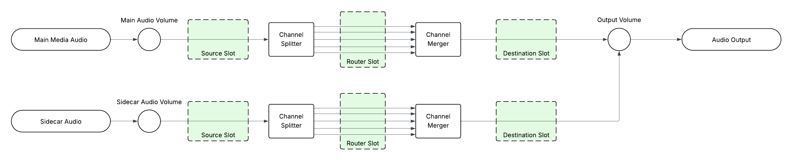

# Omakase Player

## Prerequisites

Omakase Player can be loaded as UMD module inside HTML page. If loaded as UMD module it requires hls.js loaded before Omakase Player:

```html

<script src="https://cdn.jsdelivr.net/npm/hls.js@latest"></script>
<script src="https://cdn.jsdelivr.net/npm/@byomakase/omakase-player@latest/dist/omakase-player.umd.min.js"></script>
```

Omakase Player can be used as ES module and CJS module as well.

If used with modern Typescript / Javascript frameworks (such as Angular, React or Vue), it is recommended to simply install Omakase Player as dependency into `package.json`:

```bash
npm install @byomakase/omakase-player
```

Optionally, you can include default Omakase Player CSS stylesheet or import and use  `omakase-player.scss` SCSS stylesheet.

```html

<link rel="stylesheet" href="https://cdn.jsdelivr.net/npm/@byomakase/omakase-player@latest/dist/style.min.css">
```

Stylesheet references default player overlay icons, help menu icons and default styles for video safe zones. All of which can be overridden.

## Player Initialization

Omakase Player requires div as a placeholder for HTML5 player.

```html

<div id="omakase-player"></div>
```

Initialize the player by providing div id in player configuration. If used as UMD module, Omakase Player objects are available in global `omakase` namespace:

```javascript
// Create new OmakasePlayer instance
let omakasePlayer = new omakase.OmakasePlayer({
  playerHTMLElementId: 'omakase-player',
});
```

Once player is initialized we can load hls video stream by providing stream URL and optionally stream frame rate:

```javascript
omakasePlayer.loadVideo('https://my-server.com/myvideo.m3u8').subscribe({
  next: (video) => {
    console.log(`Video loaded. Duration: ${video.duration}, totalFrames: ${video.totalFrames}`)
  }
})
```

Player chroming can be configured with the `playerChroming` property. This property allows selection of a chroming theme, watermark, thumbnail url or selection function and other theme-specific configuration. Some code examples are shown below:

```javascript
let omakasePlayer = new OmakasePlayer({
  playerChroming: {
    theme: PlayerChromingTheme.Default,
    thumbnailUrl: 'https://byomakase.org/thumbs.vtt',
    watermark: 'DEMO_SAMPLE',
    themeConfig: {
      controlBarVisibility: ControlBarVisibility.Enabled,
      controlBar: [DefaultThemeControl.Play, DefaultThemeControl.Scrubber, DefaultThemeControl.Volume, DefaultThemeControl.Trackselector, DefaultThemeControl.Fullscreen],
      trackSelectorAutoClose: false
    }
  }
});


let omakasePlayer = new OmakasePlayer({
  playerChroming: {
    theme: PlayerChromingTheme.Default,
    themeConfig: {
      controlBarVisibility: ControlBarVisibility.Disabled,
      floatingControls: [DefaultThemeFloatingControl.PlaybackControls]
    }
  }
});

let omakasePlayer = new OmakasePlayer({
  playerChroming: {
    theme: PlayerChromingTheme.Chromeless
  }
});

/*  Custom template js  */
let omakasePlayer = new OmakasePlayer({
  playerChroming: {
    theme: PlayerChromingTheme.Custom,
    themeConfig: {
      htmlTemplateId: 'custom-template'
    }
  }
});

/** Custom template HTML 
<template id="custom-template">
  <media-control-bar>
    <omakase-marker-bar></omakase-marker-bar>
    <omakase-time-range></omakase-time-range>
  </media-control-bar>
</template>
*/
```

More information about Player Chroming customization and specific theme configurations is available in [Player Chroming](https://github.com/byomakase/omakase-player/tree/main/docs/player-chroming/README.md) manual.

## Video API

Complete list of Video API methods is available in API Reference Docs

### Video playback control

Video playback control is achieved through Video API.

```javascript
// plays video
omakasePlayer.video.play()

// plays video and notifies user on successful play action
omakasePlayer.video.play().subscribe(() => {
  console.log(`Play started`);
})

// pauses video
omakasePlayer.video.pause()

// seeks to timestamp
omakasePlayer.video.seekToTime(123.45).subscribe({
  next: (result) => {
    if (result) {
      console.log(`Seek to timestamp success`);
    }
  }
})

// seeks to frame
omakasePlayer.video.seekToFrame(123).subscribe({
  next: (result) => {
    if (result) {
      console.log(`Seek to frame success`);
    }
  }
})

// toggles mute / unmute
omakasePlayer.video.toggleMuteUnmute();
```

### Events

Before or after loading video stream, we can subscribe to various events. All events are available in API objects as Observables.
Example how to subscribe to video loaded event Observable:

```javascript
// Subscribe to Observable
omakasePlayer.video.onVideoLoaded$.subscribe({
  next: (event) => {
    if (event) {
      let video = event.video;
      console.log(`Video loaded. Duration: ${video.duration}, totalFrames: ${video.totalFrames}`)
    }
  }
})
```

Video playback events subscription examples:

```javascript
omakasePlayer.video.onPlay$.subscribe({
  next: (event) => {
    console.log(`Video play. Timestamp: ${event.currentTime} => ${omakasePlayer.video.formatToTimecode(event.currentTime)}`)
  }
})

omakasePlayer.video.onPause$.subscribe({
  next: (event) => {
    console.log(`Video pause. Timestamp: ${event.currentTime} => ${omakasePlayer.video.formatToTimecode(event.currentTime)}`)
  }
})

omakasePlayer.video.onSeeked$.subscribe({
  next: (event) => {
    console.log(`Video seeked. Timestamp: ${event.currentTime} => ${omakasePlayer.video.formatToTimecode(event.currentTime)}`)
  }
})

omakasePlayer.video.onVideoTimeChange$.subscribe({
  next: (event) => {
    console.log(`Video time change. Timestamp: ${event.currentTime} => ${omakasePlayer.video.formatToTimecode(event.currentTime)}. Frame: ${event.frame}`)
  }
})
```

### Detached video player

To enable full video detaching in Omakase Player we need to instantiate another *detached* instance of Omakase Player on same host, and tell our *local* instance where to find it.

Local player instance configuration on `https://my-server.com/omp-player`:
```javascript
// local-omakase-player.js

// Local OmakasePlayer instance configuration on https://my-server.com/omp-player
let omakasePlayer = new omakase.OmakasePlayer({
  playerHTMLElementId: 'omakase-player',
  detachedPlayerUrlFn: (video, videoLoadOptions) => 'https://my-server.com/player/omp-player-detached'
});
```

Detached player instance configuration on `https://my-server.com/omp-player-detached`:
```javascript
// detached-omakase-player.js

// Local OmakasePlayer instance configuration on https://my-server.com/omp-player
let omakasePlayer = new omakase.OmakasePlayer({
  playerHTMLElementId: 'omakase-player',
  detachedPlayer: true // this OmakasePlayer instance will be run in detached mode 
});
```

We can now load a video, detach it to independent browser window and play it!:
```javascript
// local-omakase-player.js

omakasePlayer.loadVideo('https://my-server.com/myvideo.m3u8').subscribe({
  next: (video) => {
    console.log(`Video loaded`)
    
    omakasePlayer.video.detachVideoWindow().subscribe(() => {
      console.log(`Video detached`)
      
      omakasePlayer.video.play();
    })
  }
})
```

Due to security and usability policies, most modern browsers require a user interaction before allowing certain actions, such as video autoplay or fullscreen initiation.
It could be that one-time-only user interaction (such as clicking on play button in detached player) is needed before video playback or switching to fullscreen playback after video detaching.

### Hls.js

We can fetch hls.js instance through API, as well as subscribe to hls.js events:

```javascript
// Get hls.js instance and hook onto hls.js events
let hlsInstance = omakasePlayer.video.getHls();
hlsInstance.on('hlsManifestParsed', (event, data) => {
  console.log(`HLS manifest parsed`, data);
})
```

### Streaming named events

Other way to listen particular events is by using `onNamedEvent$` observable:
```javascript
// 
omakasePlayer.video.onNamedEvent$.subscribe({
  next: (event) => {
    console.log('Got named event:' + event.eventName, event)
  }
})

// activates named event streams that will be emitted in onNamedEvent$
omakasePlayer.video.updateActiveNamedEventStreams(['hlsManifestParsed', 'hlsMediaAttached', 'hlsFragLoading', 'hlsFragLoaded', 'hlsError'])
```
If detached video mode is used we should always use `onNamedEvent$`$ observable for hooking onto ie. hls.js events as hls.js API is not available in *local* window while in detached mode.

### Utilities

```javascript
// adds safe zone 10% from all player edges
omakasePlayer.chroming.addSafeZone({
  topRightBottomLeftPercent: [10, 10, 10, 10]
})

// toggles fullscreen
omakasePlayer.video.toggleFullscreen();
```

## Audio API

Complete list of Audio API methods is available in API Reference Docs.

There are two types of audio: **Main audio** and **Sidecar audio**. Main audio refers to audio source attached to video track. Main audio tracks are embedded audio tracks loaded with video and only single Main audio track can be active (playing) at same time. Sidecar audio tracks are loaded manually and they are independent of video load and Main audio. Sidecar audio tracks playback is synced with video (Main audio) playback and there can be multiple Sidecar audio tracks active (playing) at same time.

Few common usages of Audio API:

```javascript
// retrieves all available audio tracks
let audioTracks = omakasePlayer.audio.getAudioTracks();

// retrieves active audio track
let activeAudioTrack = omakasePlayer.audio.getActiveAudioTrack();

// detect audio tracks switching
omakasePlayer.audio.onAudioSwitched$.subscribe({
  next: (event) => {
    console.log(`Audio switched`, event)
  }
})

// sets another audio track as active
omakasePlayer.audio.setActiveAudioTrack(audioTracks[1].id);

```

### Main audio router
Enables routing between audio inputs and outputs.

```javascript

// creates Main audio router configured for routing between 2 inputs and 4 outputs
omakasePlayer.audio.createMainAudioRouter(2, 4); 

// connects 1st output with 2nd output
omakasePlayer.audio.routeMainAudioRouterNodes([{
  inputNumber: 0,
  outputNumber: 1,
  connected: true
}])

// disconnects 2nd input and 2nd output
omakasePlayer.audio.routeMainAudioRouterNodes([{
  inputNumber: 1,
  outputNumber: 1,
  connected: false
}])

```

### Main audio peak processor
Enables audio peak processing for analyzing audio and creating audio peaks visualizations such as [VU meter](#vu-meter).

```javascript

// creates Main audio peak sample processor
omakasePlayer.audio.createMainAudioPeakProcessor(); 

// listens for peak processor messages
omakasePlayer.audio.onMainAudioPeakProcessorMessage$.subscribe({
  next: (event) => {
	// peak processor message can be input to audio peak visualization component
    console.log(`Peak processor message`, event)
  }
})

```

### Sidecar audio

```javascript

// listens for SidecarAudioCreateEvent events
omakasePlayer.audio.onSidecarAudioCreate$.subscribe({
  next: (event) => {
    console.log(`Just created Sidecar audio track: `, event.createdSidecarAudioState)
  }
})

// listens for SidecarAudioRemoveEvent events
omakasePlayer.audio.onSidecarAudioRemove$.subscribe({
  next: (event) => {
    console.log(`Just removed Sidecar audio track: `, event.removedSidecarAudio)
  }
})

// creates new Sidecar audio track
omakasePlayer.audio.createSidecarAudioTrack({
  src: audio.url,		// sidecar audio source
  active: true, 			// make it active immediately after creation
}).subscribe({
  next: (sidecarAudioTrack) => {
    console.log(`Created new Sidecar audio track with id:`, sidecarAudioTrack.id)
  }
})

// activates Sidecar audio tracks
omakasePlayer.audio.activateSidecarAudioTracks(['sidecarAudioTrackId1', 'sidecarAudioTrackId2']);

// deactivates Sidecar audio tracks
omakasePlayer.audio.deactivateSidecarAudioTracks(['sidecarAudioTrackId1', 'sidecarAudioTrackId2']);

// removes Sidecar audio tracks
omakasePlayer.audio.removeSidecarAudioTracks(['sidecarAudioTrackId1', 'sidecarAudioTrackId2']);

// exports Main audio track as Sidecar audio track
omakasePlayer.audio.exportMainAudioTrackToSidecar('mainAudioTrackId1').subscribe({
  next: (sidecarAudioTrack) => {
    console.log(`Created new Sidecar audio track from Main audio track:`, sidecarAudioTrack)
  }
})

```

### Sidecar audio router

```javascript

// listens for SidecarAudioChangeEvent events, event is triggered ie. when Sidecar audio router changes
omakasePlayer.audio.onSidecarAudioChange$.subscribe({
  next: (event) => {
    console.log(`Just changed Sidecar audio track: `, event.changedSidecarAudioState)
  }
})

// creates Sidecar audio router configured for routing between 2 inputs and 4 outputs
omakasePlayer.audio.createSidecarAudioRouter("sidecarAudioTrackId1", 2, 4);

// connects 1st output with 2nd output
omakasePlayer.audio.routeSidecarAudioRouterNodes("sidecarAudioTrackId1", [{
  inputNumber: 0,
  outputNumber: 1,
  connected: true
}])

// disconnects 2nd input and 2nd output
omakasePlayer.audio.routeSidecarAudioRouterNodes("sidecarAudioTrackId1", [{
  inputNumber: 1,
  outputNumber: 1,
  connected: false
}])

```

### Sidecar audio peak processor
Enables audio peak processing for analyzing audio and creating audio peaks visualizations such as [VU meter](#vu-meter).

```javascript

// creates Sidecar audio peak sample processor
omakasePlayer.audio.createSidecarAudioPeakProcessor("sidecarAudioTrackId1");

// listens for peak processor messages on all Sidecar audios and filters them for single Sidecar audio track
omakasePlayer.audio.onSidecarAudioPeakProcessorMessage$
  .pipe(filter(p => p.sidecarAudioTrackId === "sidecarAudioTrackId1"))
  .subscribe({
    next: (event) => {
      // peak processor message can be input to audio peak visualization component
      console.log(`Peak processor message`, event)
    }
  })

```

### Audio router visualization
Initializes the audio router visualization component. It will create the main audio router or sidecar audio routers if they are not already created.

Parameters:

- `routerVisualizationHTMLElementId`: optional, id of the HTML element inside which to render the router visualization component (defaults to `''omakase-audio-router''`)
- `size`: optional, component size (`'small'`, `'medium'` or `'large'`, defaults to `'medium'`)
- `outputNumber`: optional, number of outputs to display (defaults to the number of detected outputs from the AudioContext)
- `outputLabels`: optional, labels to display for outputs (if not provided, default labels will be shown)
- `mainTrack`: optional, main audio router visualization options
  - `name`: optional, label to show for the main track
  - `maxInputNumber`: required, number of inputs for main audio router
  - `inputNumber`: optional, number of inputs to visualize (defaults to `maxInputNumber`)
  - `inputLabels`: optional, labels to display for main track inputs (if not provided, default labels will be shown)
- `sidecarTracks`: optional, array of sidecar audio router visualization options
  - `trackId`: required, id of the sidecar audio track

Usage example:

```html

<div id="omakase-audio-router"></div>
```

```javascript

  // creates a router visualization component with one main track and one sidecar track
  let routerVisualizationComponent = omakasePlayer.initializeRouterVisualization({
    routerVisualizationHTMLElementId: 'omakase-audio-router',
    size: 'medium',
    outputNumber: 6,
    outputLabels: ['L', 'R', 'C', 'LFE', 'Ls', 'Rs'],
    mainTrack: {
      name: '5.1 English',
      inputNumber: 6,
      maxInputNumber: 6,
      inputLabels: ['L', 'R', 'C', 'LFE', 'Ls', 'Rs'],
    },
    sidecarTracks: [
      {
        trackId: '<sidecar_track_id>',
        name: 'Stereo',
        inputNumber: 2,
        maxInputNumber: 6,
        inputLabels: ['L', 'R', 'C', 'LFE', 'Ls', 'Rs'],
      },
    ],
  });

  // updates the main track on the router visualization component
  routerVisualizationComponent.updateMainTrack({
    name: '2.0 English',
    inputNumber: 2,
    inputLabels: ['L', 'R']
  })

```

### Audio Effects

Omakase Player supports applying audio effects on both main and sidecar audio tracks. Effects are added using `OmpAudioEffectDef` interface that Omakase Player instantiates into corresponding specific `OmpAudioEffect` and includes it into audio chain. To use effects not provided by Omakase Player, you need to register the factory functions that will convert effect definitions to concrete effect objects. User never creates specific effects, only their definitions.

Omakase Player supports three predefined effect chain slots: `source`, `router` and `destination` in different audio chain locations. These slots are independent and can host audio effect chains simultaneously. Each audio track has independent slots.

The audio chains samples for main media and one audio sidecar are shown in the image below:



Adding effects to `router` slot can be further granulated with routing path that can select specific connections and apply effects on specified connections only. 

Usage example:

```js

let mainEchoEffectDef = DefaultOmpAudioEffectsGraphDef.create(
  OmpGainEffect.createDef('gain1', 1).outputTo({effectId: 'delay1'}),
  OmpDelayEffect.createDef('delay1', 0.2).outputTo('feedbackGain', 'gain2'),
  OmpGainEffect.createDef('feedbackGain', 0.5).outputTo('delay1'),
  OmpGainEffect.createDef('gain2', 1)
  );

let sidecarBalanceEffectDef = DefaultOmpAudioEffectsGraphDef.create(
  OmpGainEffect.createDef('gain', 1)
  );

// create echo effect graph on the main audio track at source slot
omakasePlayer.audio.setMainAudioEffectsGraphs(mainEchoEffectDef, {slot: 'source'})

// create sidecar audio router
omakasePlayer.audio.createSidecarAudioRouter('sidecar-1').subscribe(() => {
  // creates echo effect graph on the sidecar audio track at router slot on all routing paths
  omakasePlayer.audio.setSidecarAudioEffectsGraph('sidecar-1', sidecarBalanceEffectDef, {slot: 'router'})
})
```

Omakase Player supports changing effects parameters once the effects are created.

Usage example:

```js

// changes gain parameter of gain effect with id "gain" on routing paths terminating on output 0 inside the router slot
omakasePlayer.audio.setSidecarAudioEffectsParams(
  "sidecar-1",
  new OmpAudioEffectGainParam(0.8),
  { slot: "router", routingPath: { output: 0 } },
  { id: "gain" },
);

// changes gain parameter of gain effect with id "gain" on routing paths terminating on output 1 inside the router slot
omakasePlayer.audio.setSidecarAudioEffectsParams(
  "sidecar-1",
  new OmpAudioEffectGainParam(1.2),
  { slot: "router", routingPath: { output: 1 } },
  { id: "gain" },
);

```

#### Included audio effects

While Omakase Player supports custom audio effects as long as they conform to `OmpAudioEffect` interface, Omakase Player provides some audio effects to make more common use cases (for example audio balancing) easier.


##### OmpGainEffect

OmpGainEffect implements gain effect. Supported parameters are the same as web audio's [GainNode](https://webaudio.github.io/web-audio-api/#GainNode). 

To make usage easier Omakase Player provides `OmpAudioEffectGainParam` wrapper around the gain parameter. 
To change gain effect parameter use either `omakasePlayer.audio.setMainAudioEffectsParams` or `omakasePlayer.audio.setSidecarAudioEffectsParams` depending on where the gain effect is located. 

To create effect definition use `OmpGainEffect.createDef` static method.

Code sample:

```js
let graphDef = DefaultOmpAudioEffectsGraphDef.create(
  OmpGainEffect.createDef('gain', 0.5)
)

omakasePlayer.audio.setMainAudioEffectsGraphs(graphDef, {slot: 'source'})
```

##### OmpDelayEffect

OmpDelayEffect implements delay effect. Supported parameters are the same as web audio's [DelayNode](https://webaudio.github.io/web-audio-api/#DelayNode). 

To make usage easier Omakase Player provides `OmpAudioEffectDelayTimeParam` wrapper around the delayTime parameter. 
To change delay effect parameter use either `omakasePlayer.audio.setMainAudioEffectsParams` or `omakasePlayer.audio.setSidecarAudioEffectsParams` depending on where the delay effect is located. 

To create effect definition use `OmpDelayEffect.createDef` static method.

Code sample:

```js
let graphDef = DefaultOmpAudioEffectsGraphDef.create(
  OmpDelayEffect.createDef('delay', 0.2)
)

omakasePlayer.audio.setMainAudioEffectsGraphs(graphDef, {slot: 'destination'})
```


## Styling

Omakase Player elements (including media chrome elements) can be styled with CSS/SCSS. The CSS structure is shown below.


## Timeline

Timeline is initialized by defining div placeholder and calling `createTimeline()` API method with optional configuration and style settings.

```html

<div id="omakase-timeline"></div>
```

```javascript
omakasePlayer.createTimeline({
  // html timeline div id
  timelineHTMLElementId: 'omakase-timeline',
  // thumbnails can be loaded from VTT file and shown in Timeline Scrubber Lane on mouse hover
  thumbnailVttUrl: 'https://my-server.com/thumbnails/timeline.vtt',
  style: {
    stageMinHeight: 300,
    backgroundFill: '#fef9f7'
    // ...see API Reference Docks for all other available style properties
  }
}).subscribe({
  next: (timelineApi) => {
    console.log(`Timeline created`)
  }
})
```

## Timeline Lanes

Omakase Player supports adding various Timeline Lanes:

- Scrubber Lane
- Thumbnail Lane
- Marker Lane
- Subtitles Lane
- Audio Track Lane
- Label Lane
- Scrollbar Lane
- Line Chart Lane
- Bar Chart Lane
- Og Chart Lane

Timeline Lanes are added after Timeline creation. Base Timeline Lanes can be configured, styled and extended with custom functionalities.

### Scrubber Lane

Scrubber Lane is created automatically. Scrubber Lane instance can be fetched by using Timeline API after Timeline is created

```javascript
omakasePlayer.createTimeline().subscribe({
  next: (timelineApi) => {
    console.log(`Timeline created`);

    let scrubberLane = omakasePlayer.timeline.getScrubberLane();
    // set custom styles for Scrubber Lane
    scrubberLane.style = {
      backgroundFill: '#dfe0e2',
      tickFill: '#08327d',
      timecodeFill: '#08327d'
      // ...see API Reference Docks for all other available style properties
    }

  }
})
```

### Thumbnail Lane

Thumbnail Lane loads thumbnails from VTT file and shows them on timeline. In example below thumbnail mouse click event is handled.

```javascript
let thumbnailLane = new omakase.ThumbnailLane({
  description: 'Thumbnails',
  vttUrl: 'https://my-server.com/thumbnails.vtt'
})
omakasePlayer.timeline.addTimelineLane(thumbnailLane);

// Handle thumbnail click event
thumbnailLane.onClick$.subscribe({
  next: (event) => {
    if (event.thumbnail.cue) {
      console.log(`Seeking to to thumbnail: ${omakasePlayer.video.formatToTimecode(event.thumbnail.cue.startTime)}`);
      omakasePlayer.video.seekToTime(event.thumbnail.cue.startTime).subscribe({
        next: () => {
          console.log(`Seek complete`);
        }
      })
    }
  }
})
```

### Marker Lane

Marker Lane can be populated from VTT file or by using API methods directly:

```javascript
// marker lane
let markerLane = new omakase.MarkerLane({
  description: 'Markers',
  vttUrl: 'https://demo.player.byomakase.org/data/thumbnails/timeline.vtt', // https://my-server.com/thumbnails/timeline.vtt
  markerCreateFn: (cue, index) => {
    return new omakase.PeriodMarker({
      timeObservation: {
        start: cue.startTime,
        end: cue.endTime
      },
      text: `${cue.text}`,
      editable: true,
      style: {
        renderType: 'lane',
        color: index % 2 ? '#2677bb' : '#dd6464',
        symbolType: 'triangle'
      }
    })
  },
  markerProcessFn: (marker, index) => {
    marker.onClick$.subscribe({
      next: (event) => {
        console.log(`Clicked on marker with text: `, marker.text)
      }
    })

    marker.onChange$.subscribe({
      next: (event) => {
        console.log(`Marker time observation change: `, event)
      }
    })
  }
})
omakasePlayer.timeline.addTimelineLane(markerLane);

// manually adding markers through API
markerLane.addMarker(new omakase.MomentMarker({
  timeObservation: {
    time: 100
  },
  style: {
    renderType: 'spanning',
    color: '#ff0000',
    symbolType: 'circle'
  }
}));
```

### Subtitles Lane

Subtitles Lane is used for subtitles visualisation on timeline. It is populated from VTT file.

```javascript
let subtitlesLane = new omakase.SubtitlesLane({
  description: 'Subtitles',
  vttUrl: 'https://my-server.com/subtitles.vtt'
})
omakasePlayer.timeline.addTimelineLane(subtitlesLane);
```

### Audio Track Lane

Audio Track Lane is used for audio track visualisation.

```javascript
let audioTrackLane = new omakase.AudioTrackLane({
  description: 'Audio Track',
  vttUrl: 'https://my-server.com/audio-track.vtt'
})
omakasePlayer.timeline.addTimelineLane(audioTrackLane);
```

### Label Lane

Label Lane is usually used on timeline as grouping lane that contains other timeline components, such as timeline buttons and labels.

```javascript
let labelLane = new omakase.LabelLane({
  description: 'Label lane', // appears in left pane
  text: 'Right pane label', // appears in right pane
  style: {
    backgroundFill: '#a5a6a9',
    textFill: '#f45844',
    textFontSize: 20
  }
});
omakasePlayer.timeline.addTimelineLane(labelLane);
```

### Scrollbar Lane

Scrollbar Lane contains Timeline scrollbar that controls timeline zoom and scroll.

```javascript
// scrollbar lane
let scrollbarLane = new omakase.ScrollbarLane({
  description: ''
});
omakasePlayer.timeline.addTimelineLane(scrollbarLane);
```

### Line Chart Lane

Line Chart Lane for data visualisation.

```javascript
let lineChartLane = new omakase.LineChartLane({
  vttUrl: 'https://my-server.com/line-chart.vtt',
  yMax: 100, // optional custom max value, if not provided it will be resolved from data
  yMin: -50, // optional custom min value, if not provided it will be resolved from data
  style: {
    pointWidth: 5,
    lineStrokeWidth: 2
  },
});
omakasePlayer.timeline.addTimelineLane(lineChartLane);
```

### Bar Chart Lane

Bar Chart Lane for data visualisation.

```javascript
let barChartLane = new omakase.BarChartLane({
  vttUrl: 'https://my-server.com/bar-chart.vtt',
  description: 'Bar Chart',
  valueMax: 120,  // optional custom max value, if not provided it will be resolved from data
  valueMin: 50,   // optional custom min value, if not provided it will be resolved from data
  valueTransformFn: (value) => {
    // each value can be transformed in this hook function
    return value;
  },
  itemProcessFn: (item, index) => {
    // each chart item can be processed in this hook function
    item.onClick$.subscribe({
      next: (event) => {
        console.log(event, item)
      }
    })
  },
  valueInterpolationStrategy: 'max' // average - take interpolated points average | max - take interpolated points max
});
omakasePlayer.timeline.addTimelineLane(barChartLane);
```

### OG Chart Lane

OG Chart Lane for data visualisation.

```javascript
let ogChartLane = new omakase.OgChartLane({
  vttUrl: 'https://my-server.com/og-chart.vtt',
  description: 'Bar Chart',
  valueMax: 120,  // optional custom max value, if not provided it will be resolved from data
  valueMin: 50,   // optional custom min value, if not provided it will be resolved from data
  valueTransformFn: (value) => {
    // each value can be transformed in this hook function
    return value;
  },
  itemProcessFn: (item, index) => {
    // each chart item can be processed in this hook function
    item.onClick$.subscribe({
      next: (event) => {
        console.log(event, item)
      }
    })
  },
  valueInterpolationStrategy: 'max' // average - take interpolated points average | max - take interpolated points max
});
omakasePlayer.timeline.addTimelineLane(ogChartLane);
```

## Timeline Lane API

### Timeline Lane Nodes

Timeline Lane Nodes can be added to Timeline Lane instances with `addTimelineNode()` API method. Nodes types that can be added are:

- Image button
- Text label

In this example, Timeline zoom in and zoom out buttons are added to Scrubber Lane:

```javascript
let scrubberLane = omakasePlayer.timeline.getScrubberLane();

// define zoom in button
let zoomInButton = new omakase.ImageButton({
  src: `https://my-server.com/images/plus-circle.svg`,
  width: 30,
  height: 30,
  listening: true // set to true if button is interactive
})

// handle click event
zoomInButton.onClick$.subscribe({
  next: (event) => {
    omakasePlayer.timeline.zoomInEased().subscribe();
  }
})

// define zoom out button
let zoomOutButton = new omakase.ImageButton({
  src: `https://my-server.com/images/minus-circle.svg`,
  width: 30,
  height: 30,
  listening: true
})

// handle click event
zoomOutButton.onClick$.subscribe({
  next: (event) => {
    omakasePlayer.timeline.zoomOutEased().subscribe();
  }
});

// add buttons to scrubber lane
[zoomOutButton, zoomInButton].forEach(button => {
  scrubberLane.addTimelineNode({
    width: button.config.width,
    height: button.config.height,
    justify: 'end',
    timelineNode: button,
  })
});
```

### Minimize, Maximize

Timeline Lane in Timeline can be minimized or maximized by calling methods from `TimelineLaneApi`.  
In this example, Grouping Label Lane is created at specific index on Timeline. *Minimize* and *Maximize* Text Label action buttons are created and added to Timeline Lane left pane.

```javascript
// marker lane group
let markerLaneGroup = new omakase.LabelLane({
  text: 'Marker Lane Group', // appears in right pane
  style: {
    backgroundFill: '#c2b4a6',
    textFill: '#fbfbfb'
  }
});

// add grouping lane before MarkerLane
omakasePlayer.timeline.addTimelineLaneAtIndex(markerLaneGroup, omakasePlayer.timeline.getTimelineLanes().findIndex(p => p.id === markerLane.id));

// minimize text label
let textLabelMinimize = new omakase.TextLabel({
  text: `Minimize`,
  listening: true,
  style: {
    align: 'center',
    verticalAlign: 'middle',
    fill: '#ffffff',
    backgroundFill: '#f45844',
    backgroundBorderRadius: 3
  }
});

// maximize text label
let textLabelMaximize = new omakase.TextLabel({
  text: `Maximize`,
  listening: true,
  style: {
    align: 'center',
    verticalAlign: 'middle',
    fill: '#ffffff',
    backgroundFill: '#46454b',
    backgroundBorderRadius: 3
  }
});

// minimize lane on click
textLabelMinimize.onClick$.subscribe({
  next: () => {
    if (!markerLane.isMinimized()) {
      markerLane.minimizeEased().subscribe()
    }
  }
})

// maximize lane on click
textLabelMaximize.onClick$.subscribe({
  next: () => {
    if (markerLane.isMinimized()) {
      markerLane.maximizeEased().subscribe()
    }
  }
});

// add text labels to grouping lane left pane
[textLabelMinimize, textLabelMaximize].forEach(textLabel => {
  markerLaneGroup.addTimelineNode({
    width: 60,
    height: 22,
    justify: 'start',
    margin: [0, 5, 0, 0],
    timelineNode: textLabel
  });
})
```

## Marker List API

Marker list is initialized by defining div placeholder and calling `createMarkerList()` API method with optional configuration.
The marker list web component will be added into a html element with id defined in `markerListHTMLElementId`. If this parameter is not provided, it will default to`omakase-player-marker-list`. Following code will instantiate an empty marker list.

```html

<div id="marker-list"></div>
```

```javascript

omakasePlayer.createMarkerList({
  markerListHTMLElementId: 'marker-list'
})

```

### Loading markers from a VTT file

A marker list can be loaded from a VTT file. In this case a function to create a marker list item from VTT file cues can also be provided, as well as HTML content to render while the file is loading.

```html

<div id="marker-list"></div>
<template id="loading-template">
  <!-- content to render while the VTT file is loading -->
</template>
```

```javascrip
const colors = ['red', 'green', 'blue']

omakasePlayer.createMarkerList({
  loadingHTMLElementId: 'loading-template',
  vttUrl: './markers.vtt',
  vttMarkerCreateFn: (cue, index) => ({
    name: 'VTT Marker ' + index,
    timeObservation: {
      start: cue.startTime,
      end: cue.endTime
    },
    style: {
      color: colors[index % colors.length]
    },
    data: {
      custom_key: 'custom value'
    }
  })
})
```

### Deep linking with timeline lanes

Marker list can also be linked to one or multiple timeline lanes. If linked in this way, the markers from the timeline lane(s) will appear on the marker list and they will stay in sync regardless if markers are added to Marker List or timeline lane(s).

```javascript
omakasePlayer.createMarkerList({
  source: [
    omakasePlayer.timeline.getTimelineLane('marker-lane-1'),
    omakasePlayer.timeline.getTimelineLane('marker-lane-2')
  ]
})
```

### Thumbnails

Thumbnail VTT file can be passed using `thumbnailVttFile` property. If provided, it will be used to automatically set the thumbnail to the closest vtt cue based on the marker start time.
You can also use `thumbnailFn` property for defining a function that will provide a thumbnail url for any given time.

```javascript

omakasePlayer.createMarkerList({
  thumbnailVttFile: omakasePlayer.timeline.thumbnailVttFile
})

```

### CRUD methods

The following methods are available on the marker list. Usage examples are shown below.

- `addMarker`
- `updateMarker`
- `removeMarker`
- `toggleMarker`

```javascript
omakasePlayer.createMarkerList().subscribe(markerList => {
// add marker
  const marker = markerList.addMarker({
    name: 'Marker',
    timeObservation: {
      start: 100,
      end: 200
    },
    style: {
      color: 'red'
    }
  })

// update marker
  markerList.updateMarker(marker.id, {timeObservation: {start: 100, end: 300}})

// set marker as active/inactive
  markerList.toggleMarker(marker.id)

// remove marker
  markerList.removeMarker(marker.id)
})
```

### Styling and templating

Marker list HTML and style can be customised by passing a css file url and template element ids.

A template for the marker list row can include slots to render data or trigger actions. The following slots are predefined:

- `color` (from marker `style` property)
- `thumbnail` (found in the `thumbnailVttFile`, if provided)
- `name` (marker `text` property)
- `track` (name of the linked timeline lane, if applicable)
- `start` (`start` or `time` property from marker `timeObservation`)
- `end` (`end` property from marker `timeObservation`)
- `duration` (difference between `end` and `start`)
- `remove` (triggers marker removal)

Beside predefined slots, dynamic slots can be used to display custom data or trigger custom actions. Custom data slots must be prefixed with `data-` and custom actions slots must be prefixed with `action-`.

The parameter `styleUrl` can be an array to provide multiple css files.

```html

<template id="row-template">
  <div slot="color"></div>
  <div slot="name"></div>
  <div slot="start"></div>
  <div slot="end"></div>
  <div class="actions">
    <span slot="action-edit"></span>
    <span slot="remove"></span>
  </div>
</template>

<template id="header-template">
  <!-- header content -->
</template>

<template id="empty-template">
  <!-- content to render if marker list is empty -->
</template>
```

```javascript
omakasePlayer.createMarkerList({
  templateHTMLElementId: 'row-template',
  headerHTMLElementId: 'header-template',
  emptyHTMLElementId: 'empty-template',
  styleUrl: './style.css'
})
```

### Events

The following action events are provided:

- `onMarkerClick$` (triggered when the marker row is clicked)
- `onMarkerAction$` (triggered when a custom element provided with an `action-<name>` slot is clicked)

The following marker lifecycle events are provided:

- `onMarkerCreate$`
- `onMarkerUpdate$`
- `onMarkerDelete$`
- `onMarkerInit$`

Some usage examples are shown below:

```javascript
omakasePlayer.createMarkerList().subscribe(markerList => {
  markerList.onMarkerClick$.subscribe(event => {
    console.log(event.marker)
  })
  markerList.onMarkerAction$.subscribe(event => {
    console.log(event.action, event.marker)
  })
})
```

### Destroy

Marker list can be destroyed with the `destroy()` method. This cleans up the marker list resources and removes it from the DOM.

## Subtitles API

Complete list of Audio API methods is available in API Reference Docs.
Omakase Player automatically identifies all available subtitles VTT tracks from stream manifest and makes them available through Subtitles API.

```javascript
omakasePlayer.subtitles.onSubtitlesLoaded$.subscribe({
  next: (event) => {
    // retrieves all subtitles VTT tracks
    let subtitlesVttTracks = omakasePlayer.subtitles.getTracks();

    // shows first available VTT track
    omakasePlayer.subtitles.showTrack(subtitlesVttTracks[0].id)
  }
})
```

Subtitles can be imported from external VTT file:

```javascript
// import subtitles from VTT file
omakasePlayer.subtitles.createVttTrack({
  id: '0',
  src: 'https://my-server.com/subtitles.vtt',
  label: 'English (US)',
  language: 'en-us',
  default: true
}).subscribe({
  next: (subtitlesVttTrack) => {
    console.log(`Subtitles successfully created`)
  }
})
```

## VU Meter

Omakase Player easily integrates with [VU Meter](https://github.com/byomakase/vu-meter). VU Meter is using data provided by Omakase Player's peak processor created on either Main audio track or on Sidecar audio tracks. See examples provided on [VU Meter Github repository](https://github.com/byomakase/vu-meter).

## Development

Player build & build watch

```bash
npm install ci
npm run dev
```

## Production build

```bash
npm install ci
npm run prod
```

Production artefacts that need to be published to NPM are created in `/dist` folder

## Known limitations

- Safari browser doesn't support Main audio routing and Main audio VU Meter for HLS streams. This constraint can be bypassed by loading the Main audio as a Sidecar track using `exportMainAudioTrackToSidecar` method.

## Breaking changes
- New ```chroming``` API is introduced so chroming related API methods are migrated to this new API

- As of version 0.16.1-SNAPSHOT.1745311857, frame rate was made optional and moved to video loading options. This changes the ``videoLoad`` function signature.

Old (pre version 0.16.1-SNAPSHOT.1745311857):

```typescript
omakasePlayer.loadVideo('https://my-server.com/myvideo.m3u8', 25) // 25 - frame rate
```

New (version 0.16.1-SNAPSHOT.1745311857 and onwards):

```typescript
omakasePlayer.loadVideo('https://my-server.com/myvideo.m3u8', {
  frameRate: 25
})
```

