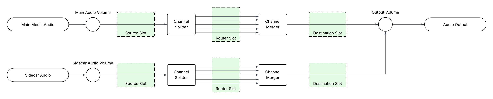

# Omakase Player

Omakase Player is an open source JavaScript player for building frame accurate video experiences.

  [Omakase Player](https://api.player.byomakase.org/interfaces/OmakasePlayerApi.html) is constructed from the following main components:

  - [Track Repository](https://api.player.byomakase.org/interfaces/OmakaseTrackApi.html) as central place containing all the media used in Omakase Player and its components
  - [Media Player](https://api.player.byomakase.org/interfaces/PlayerApi.html) as Main and Sidecar media player
  - [Chroming](https://api.player.byomakase.org/interfaces/ChromingApi.html) as Omakase Player user interface, visualization and control surface
  - [Timeline](https://api.player.byomakase.org/interfaces/TimelineApi.html) as Multi-track timeline with unlimited depth for timed media visualization and control
  - [Marker List Component](https://api.player.byomakase.org/interfaces/MarkerListApi.html) as Segments visualization and control surface organized into cut-lists
  - [Tools](https://api.player.byomakase.org/interfaces/OmakaseToolsApi.html) and [Alerts](https://api.player.byomakase.org/interfaces/AlertsApi.html) as helpers for various general utils and interaction with end users with alerts
  - [VU Meter](https://api.player.byomakase.org/interfaces/VuMeterApi.html) as Volume levels visualization tool


> For versions prior to v1.0.0 please refer to [v0.25.4 API documentation](https://api.player.byomakase.org/archive/0.25.4/)

## Prerequisites

Omakase Player can be loaded as ES6 module inside HTML page. If loaded as ES6 module it requires hls.js loaded before Omakase Player:

```html
<script type="importmap">
  {
    "imports": {
      "hls.js": "https://cdn.jsdelivr.net/npm/hls.js@latest/dist/hls.mjs",
      "@omakase-player": "https://cdn.jsdelivr.net/npm/@byomakase/omakase-player@latest/dist/omakase-player.es.min.js"
    }
  }
</script>
```

Later on use regular object imports in JavaScript code.

```javascript
import {OmakasePlayer} from '@omakase-player';
let omakasePlayer = new OmakasePlayer();
```

Omakase Player can be used as ES module in TypeScript projects as follows.

If used with modern Typescript / Javascript frameworks (such as Angular, React or Vue), it is recommended to simply install Omakase Player as dependency into `package.json`:

```bash
npm install @byomakase/omakase-player
```

Optionally, you can include default Omakase Player CSS stylesheet or import and use `omakase-player.scss` SCSS stylesheet.

```html
<link rel="stylesheet" href="https://cdn.jsdelivr.net/npm/@byomakase/omakase-player@latest/dist/style.min.css" />
```

Stylesheet references default player overlay icons, help menu icons and default styles for video safe zones. All of which can be overridden.

## Player Initialization

Omakase Player requires div as a placeholder for HTML5 player.

```html
<div id="omakase-player"></div>
```

Initialize the player by providing div id in player configuration. If used as UMD module, Omakase Player objects are available in global `omakase` namespace:

```javascript
// Create new OmakasePlayer instance
let omakasePlayer = new omakase.OmakasePlayer({
  playerHTMLElementId: 'omakase-player',
});
```

Once player is initialized we can load main media by providing URL:

```javascript
omakasePlayer.loadMainMedia('https://my-server.com/myvideo.m3u8').subscribe({
  next: (mainMedia) => {
    console.log(`Main media loaded. Duration: ${mainMedia.duration}`);
  },
});
```

Player chroming can be configured with the `chroming` property. This property allows selection of a chroming theme, watermark, thumbnail url or selection function and other theme-specific configuration. Some code examples are shown below:

```javascript
let omakasePlayer = new OmakasePlayer({
  chroming: {
    theme: ChromingTheme.Default,
    thumbnailUrl: 'https://my-server.com/thumbs.vtt',
    watermark: 'DEMO_SAMPLE',
    themeConfig: {
      controlBarVisibility: ControlBarVisibility.Enabled,
      controlBar: [DefaultThemeControl.Play, DefaultThemeControl.Scrubber, DefaultThemeControl.Volume, DefaultThemeControl.Trackselector, DefaultThemeControl.Fullscreen],
      trackSelectorAutoClose: false,
    },
  },
});

let omakasePlayer = new OmakasePlayer({
  chroming: {
    theme: ChromingTheme.Default,
    themeConfig: {
      controlBarVisibility: ControlBarVisibility.Disabled,
      floatingControls: [DefaultThemeFloatingControl.PlaybackControls],
    },
  },
});

let omakasePlayer = new OmakasePlayer({
  chroming: {
    theme: PlayerChromingTheme.Chromeless,
  },
});

/*  Custom template js  */
let omakasePlayer = new OmakasePlayer({
  chroming: {
    theme: ChromingTheme.Custom,
    themeConfig: {
      htmlTemplateId: 'custom-template',
    },
  },
});

/** Custom template HTML 
<template id="custom-template">
  <media-control-bar>
    <omakase-marker-bars></omakase-marker-bars>
    <omakase-time-range></omakase-time-range>
  </media-control-bar>
</template>
*/
```

More information about Player Chroming customization and specific theme configurations is available in [Player Chroming](https://api.player.byomakase.org/documents/ChromingApi.README.html) manual.

## Player API

Complete list of Player API methods is available in API Reference Docs

### Playback control

Playback control is achieved through Player API.

```javascript
// plays video
omakasePlayer.player.play();

// plays video and notifies user on successful play action
omakasePlayer.player.play().subscribe(() => {
  console.log(`Play started`);
});

// pauses video
omakasePlayer.player.pause();

// seeks to timestamp
omakasePlayer.player.seekTo(123.45).subscribe({
  next: (result) => {
    if (result) {
      console.log(`Seek to timestamp success`);
    }
  },
});

// seeks to frame
omakasePlayer.video.seekTo(123, omakase.MediaTemporalFormat.FRAME_COUNT).subscribe({
  next: (result) => {
    if (result) {
      console.log(`Seek to frame success`);
    }
  },
});
```

### Events

Before or after loading media, we can observe various events. All events are emitted through the joint `onEvent$` observable

```javascript
// Subscribe to Observable
omakasePlayer.player.onEvent$.subscribe({
  next: (event) => {
    if (event.type === omakase.PlayerEventType.PLAYER_MAIN_MEDIA_LOADED) {
      let mainMediaState = event.data.mainMediaState;
      console.log(`Media loaded. Duration: ${mainMediaState.duration}`);
    }
  },
});
```

Video playback events subscription examples:

```javascript
omakasePlayer.player.onEvent$.pipe(rxjs.filter((event) => event.type === omakase.PlayerEventType.PLAYER_PLAY)).subscribe({
  next: (event) => {
    console.log(`Media play. Timestamp: ${event.data.currentTime}`);
  },
});

omakasePlayer.player.onEvent$.pipe(rxjs.filter((event) => event.type === omakase.PlayerEventType.PLAYER_PAUSE)).subscribe({
  next: (event) => {
    console.log(`Media pause. Timestamp: ${event.data.currentTime}`);
  },
});

omakasePlayer.player.onEvent$.pipe(rxjs.filter((event) => event.type === omakase.PlayerEventType.PLAYER_SEEKED)).subscribe({
  next: (event) => {
    console.log(`Media seeked. Timestamp: ${event.data.currentTime}`);
  },
});

omakasePlayer.player.onEvent$.pipe(rxjs.filter((event) => event.type === omakase.PlayerEventType.PLAYER_PLAYBACK_PROGRESS)).subscribe({
  next: (event) => {
    console.log(`Media time change. Timestamp: ${event.data.currentTime}`);
  },
});
```

### Detached media player

To enable full media detaching in Omakase Player we need to instantiate a _detached_ instance of Omakase Player on same host, and tell our _local_ instance where to find it.

Local player instance configuration on `https://my-server.com/omp-player`:

```javascript
// local-omakase-player.js

// Local OmakasePlayer instance configuration on https://my-server.com/omp-player
let omakasePlayer = new omakase.OmakasePlayer({
  playerHTMLElementId: 'omakase-player',
  detachedPlayerUrlFn: (mainMedia) => 'https://my-server.com/player/omp-player-detached',
});
```

Detached player instance configuration on `https://my-server.com/omp-player-detached`:

```javascript
// detached-omakase-player.js

// Detached OmakasePlayer instance configuration on https://my-server.com/omp-player-detached
let omakasePlayer = new omakase.OmakasePlayerDetached({
  playerHTMLElementId: 'omakase-player',
});
```

We can now load main media, detach it to independent browser window and play it!:

```javascript
// local-omakase-player.js

omakasePlayer.loadMainMedia('https://my-server.com/myvideo.m3u8').subscribe({
  next: (mainMedia) => {
    console.log(`Main media loaded`);

    omakasePlayer.detachPlayer().subscribe(() => {
      console.log(`Main media detached`);

      omakasePlayer.player.play();
    });
  },
});
```

Due to security and usability policies, most modern browsers require a user interaction before allowing certain actions, such as video autoplay or fullscreen initiation.
It could be that one-time-only user interaction (such as clicking on play button in detached player) is needed before video playback or switching to fullscreen playback after video detaching.

### Playback engine

We can get the playback engines used for the main media. If HLS media is loaded, then hls.js instance can be fetched.

```javascript
// Get hls.js instance and hook onto hls.js events
let hlsPlaybackEngine = omakasePlayer.player.getPlaybackEngine(MainMediaType.HLS);
hlsPlaybackEngine.hls.on('hlsManifestParsed', (event, data) => {
  console.log(`HLS manifest parsed`, data);
});
```

### Utilities

```javascript
// adds safe zone 10% from all player edges
omakasePlayer.chroming.addSafeZone({
  topRightBottomLeftPercent: [10, 10, 10, 10],
});

// toggles fullscreen
omakasePlayer.player.toggleFullscreen();
```

## Audio API

Complete list of Audio API methods is available in API Reference Docs.

There are two types of audio: **Main audio** and **Sidecar audio**. Main audio refers to audio source attached to main media track. Main audio tracks are embedded audio tracks loaded with main media and only single Main audio track can be active (playing) at same time. Sidecar audio tracks are loaded manually and they are independent of main media load and Main audio. Sidecar audio tracks playback is synced with main media (Main audio) playback and there can be multiple Sidecar audio tracks active (playing) at same time.

Few common usages of Audio API:

```javascript
// retrieves all available audio tracks
let audioTracks = omakasePlayer.player.audio.getTracks();


// detect audio tracks switching
omakasePlayer.player.audio.onEvent$.pipe(filter((event) => event.type === omakase.PlayerAudioEventType.PLAYER_AUDIO_TRACK_SWITCHED)).subscribe({
  next: (event) => {
    console.log(`Audio switched`, event);
  },
});

// sets another audio track as active
omakasePlayer.player.audio.switchTrack(audioTracks[1].id, true);
```

### Main audio router

Enables routing between audio inputs and outputs.

```javascript
// creates Main audio router configured for routing between 2 inputs and 4 outputs
omakasePlayer.player.audio
  .getHandler(PlayerAudioType.MAIN)
  .createAudioRouter(2, 4)
  .subscribe(() => {
    // connects 1st input with 2nd output
    // disconnects 2nd input and 2nd output
    omakasePlayer.player.audio.getHandler(PlayerAudioType.MAIN).router.updateConnections([
      {
        path: {input: 0, output: 1},
        connected: true,
      },
      {
        path: {input: 1, output: 1},
        connected: false,
      },
    ]);
  });
```

### Main audio peak processor

Enables audio peak processing for analyzing audio and creating audio peaks visualizations such as [VU meter](#vu-meter).

```javascript
// creates Main audio peak sample processor
omakasePlayer.player.audio.getHandler(PlayerAudioType.MAIN).createMainAudioPeakProcessor();

// listens for peak processor messages
omakasePlayer.audio.getHandler(PlayerAudioType.MAIN).onPeakProcessorEvent$.subscribe({
  next: (event) => {
    // peak processor message can be input to audio peak visualization component
    console.log(`Peak processor message`, event);
  },
});
```

### Sidecar audio

```javascript
// listens for SidecarAudioCreateEvent events
omakasePlayer.player.audio.onEvent$.pipe(rxjs.filter((event) => event.type === PlayerAudioEventType.PLAYER_AUDIO_TRACK_LOADED)).subscribe({
  next: (event) => {
    console.log(`Just created Sidecar audio track: `, event.data.playerAudioTrack);
  },
});

// listens for SidecarAudioRemoveEvent events
omakasePlayer.player.audio.onEvent$.pipe(rxjs.filter((event) => event.type === PlayerAudioEventType.PLAYER_AUDIO_TRACK_UNLOADED)).subscribe({
  next: (event) => {
    console.log(`Just removed Sidecar audio track: `, event.data.playerAudioTrack);
  },
});

// creates new Sidecar audio track
omakasePlayer.player
  .loadSidecarTrack(sidecarAudioUrl, {
    trackType: omakase.TrackType.AUDIO,
  })
  .subscribe({
    next: (sidecarAudioTrackState) => {
      console.log(`Created new Sidecar audio track with id:`, sidecarAudioTrackState.id);
    },
  });

// activates Sidecar audio tracks
omakasePlayer.player.audio.switchTrack('sidecarAudioTrackId1', true);

// deactivates Sidecar audio tracks
omakasePlayer.player.audio.switchTrack('sidecarAudioTrackId1', false);

// removes Sidecar audio tracks
omakasePlayer.player.removeSidecarTrack('sidecarAudioTrackId1');

```

### Sidecar audio router

```javascript
// listens for SidecarAudioChangeEvent events, event is triggered ie. when Sidecar audio router changes
// once the router is created you can subscribe to its event through `audioHandler.router.onEvent$`
omakasePlayer.player.audio
  .getHandler(PlayerAudioType.SIDECAR, 'sidecarAudioTrackId1')
  .onEvent$.pipe(rxjs.filter((event) => event.type === AudioHandlerEventType.AUDIO_HANDLER_CHANGE))
  .subscribe({
    next: (event) => {
      console.log(`Just changed Sidecar audio track: `, event.changedSidecarAudioState);
    },
  });

// creates Sidecar audio router configured for routing between 2 inputs and 4 outputs
omakasePlayer.player.audio.getHandler(PlayerAudioType.SIDECAR, 'sidecarAudioTrackId1').createAudioRouter(2, 4);

// connects 1st output with 2nd output
omakasePlayer.player.audio.getHandler(PlayerAudioType.SIDECAR, 'sidecarAudioTrackId1').router.updateConnections([
  {
    path: {input: 0, output: 1},
    connected: true,
  },
]);

// disconnects 2nd input and 2nd output
omakasePlayer.player.audio.getHandler(PlayerAudioType.SIDECAR, 'sidecarAudioTrackId1').router.updateConnections([
  {
    path: {input: 1, output: 1},
    connected: false,
  },
]);
```

### Sidecar audio peak processor

Enables audio peak processing for analyzing audio and creating audio peaks visualizations such as [VU meter](#vu-meter).

```javascript
// creates Sidecar audio peak sample processor
omakasePlayer.player.audio.getHandler(PlayerAudioType.SIDECAR, 'sidecarAudioTrackId1').createPeakProcessor();

// listens for peak processor messages on all Sidecar audios and filters them for single Sidecar audio track
omakasePlayer.player.audio.getHandler(PlayerAudioType.SIDECAR, 'sidecarAudioTrackId1').onPeakProcessorEvent$.subscribe({
  next: (event) => {
    // peak processor message can be input to audio peak visualization component
    console.log(`Peak processor message`, event);
  },
});
```

### Audio router visualization

Initializes the audio router visualization component. It will create the main audio router or sidecar audio routers if they are not already created.

Parameters:

- `routerVisualizationHTMLElementId`: optional, id of the HTML element inside which to render the router visualization component (defaults to `'omakase-audio-router'`)
- `size`: optional, component size (`'small'`, `'medium'` or `'large'`, defaults to `'medium'`)
- `outputNumber`: optional, number of outputs to display (defaults to the number of detected outputs from the AudioContext)
- `outputLabels`: optional, labels to display for outputs (if not provided, default labels will be shown)
- `visualizationTracks`: optional, array of router visualization tracks
  - `name`: optional, label to show for the main track
  - `maxInputNumber`: required, number of inputs for main audio router
  - `inputNumber`: optional, number of inputs to visualize (defaults to `maxInputNumber`)
  - `inputLabels`: optional, labels to display for main track inputs (if not provided, default labels will be shown)
  - `trackId`: optional, id of the sidecar audio track, if not provided the visualization track will be treated as main track

Usage example:

```html
<div id="omakase-audio-router"></div>
```

```javascript
// creates a router visualization component with one main track and one sidecar track
let routerVisualizationComponent = new RouterVisualization(
  {
    routerVisualizationHTMLElementId: 'omakase-audio-router',
    size: 'medium',
    outputNumber: 6,
    outputLabels: ['L', 'R', 'C', 'LFE', 'Ls', 'Rs'],
    visualizationTracks: [
      {
        name: '5.1 English',
        inputNumber: 6,
        maxInputNumber: 6,
        inputLabels: ['L', 'R', 'C', 'LFE', 'Ls', 'Rs'],
      },
      {
        trackId: '<sidecar_track_id>',
        name: 'Stereo',
        inputNumber: 2,
        maxInputNumber: 6,
        inputLabels: ['L', 'R', 'C', 'LFE', 'Ls', 'Rs'],
      },
    ],
  },
  omakasePlayer
);
```

### Audio Effects

Omakase Player supports applying audio effects on main, sidecar, and output audio handlers. Effects are added using `AudioEffectDef` interface that Omakase Player instantiates into corresponding specific `AudioEffect` and includes it into the handlers audio chain. To use effects not provided by Omakase Player, you need to register the factory functions that will convert effect definitions to concrete effect objects. User never creates specific effects, only their definitions.

Omakase Player supports three predefined effect chain slots: `source`, `router` and `destination` in different audio chain locations. These slots are independent and can host audio effect chains simultaneously. Each audio handler has independent slots.

The audio chains samples for main media and one audio sidecar are shown in the image below:



Adding effects to `router` slot can be further granulated with routing path that can select specific connections and apply effects on specified connections only.

Usage example:

```js
let mainEchoEffectDef = AudioEffectGraphDef.create(
  GainEffect.createDef('gain1', 1).outputTo({effectId: 'delay1'}),
  DelayEffect.createDef('delay1', 0.2).outputTo('feedbackGain', 'gain2'),
  GainEffect.createDef('feedbackGain', 0.5).outputTo('delay1'),
  GainEffect.createDef('gain2', 1)
);

let sidecarBalanceEffectDef = AudioEffectGraphDef.create(GainEffect.createDef('gain', 1));

// create echo effect graph on the main audio track at source slot
omakasePlayer.player.audio.getHandler(PlayerAudioType.MAIN).effects.setEffectGraph(mainEchoEffectDef, {slot: 'source'});

// create sidecar audio router
omakasePlayer.player.audio
  .getHandler(PlayerAudioType.SIDECAR, 'sidecarAudioTrackId1')
  .createAudioRouter()
  .subscribe(() => {
    // creates echo effect graph on the sidecar audio track at router slot on all routing paths
    omakasePlayer.player.audio.getHandler(PlayerAudioType.SIDECAR, 'sidecarAudioTrackId1').effects.setEffectGraph(sidecarBalanceEffectDef, {slot: 'router'});
  });
```

Omakase Player supports changing effects parameters once the effects are created.

Usage example:

```js
// changes gain parameter of gain effect with id "gain" on routing paths terminating on output 0 inside the router slot
omakasePlayer.player.audio
  .getHandler(PlayerAudioType.SIDECAR, 'sidecarAudioTrackId1')
  .effects.setEffectsParams(new AudioEffectGainParam(0.8), {slot: 'router', routingPath: {output: 0}}, {id: 'gain'});

// changes gain parameter of gain effect with id "gain" on routing paths terminating on output 1 inside the router slot
omakasePlayer.player.audio
  .getHandler(PlayerAudioType.SIDECAR, 'sidecarAudioTrackId1')
  .effects.setEffectsParams(new AudioEffectGainParam(1.2), {slot: 'router', routingPath: {output: 1}}, {id: 'gain'});
```

#### Included audio effects

While Omakase Player supports custom audio effects as long as they conform to `AudioEffect` interface, Omakase Player provides some audio effects to make more common use cases (for example audio balancing) easier.

##### GainEffect

GainEffect implements gain effect. Supported parameters are the same as web audio's [GainNode](https://webaudio.github.io/web-audio-api/#GainNode).

To make usage easier Omakase Player provides `AudioEffectGainParam` wrapper around the gain parameter.

To create effect definition use `GainEffect.createDef` static method.

Code sample:

```js
let graphDef = AudioEffectGraphDef.create(GainEffect.createDef('gain', 0.5));

omakasePlayer.player.audio.getHandler(PlayerAudioType.MAIN).effects.setEffectGraph(graphDef, {slot: 'source'});
```

##### DelayEffect

DelayEffect implements delay effect. Supported parameters are the same as web audio's [DelayNode](https://webaudio.github.io/web-audio-api/#DelayNode).

To make usage easier Omakase Player provides `AudioEffectDelayTimeParam` wrapper around the delayTime parameter.

To create effect definition use `DelayEffect.createDef` static method.

Code sample:

```js
let graphDef = AudioEffectsGraphDef.create(DelayEffect.createDef('delay', 0.2));

omakasePlayer.player.audio.getHandler(PlayerAudioType.MAIN).effects.setEffectGraph(graphDef, {slot: 'destination'});
```

## Styling

Omakase Player elements (including media chrome elements) can be styled with CSS/SCSS. The CSS structure is shown below.


### Sizing

The player's dimensions can be controlled with three CSS custom properties set on the player's container element or any ancestor:

| CSS Variable | Description |
|---|---|
| `--omakase-player-width` | Sets the width of the player. Accepts any valid CSS length value (e.g. `800px`, `100%`). |
| `--omakase-player-height` | Sets the height of the player. Accepts any valid CSS length value (e.g. `450px`, `50vh`). |
| `--omakase-player-aspect-ratio` | Sets the aspect ratio of the player (e.g. `16 / 9`, `4 / 3`). When not specified, the aspect ratio is derived automatically from the loaded media. |

```css
#omakase-player {
  --omakase-player-width: 100%;
  --omakase-player-aspect-ratio: 16 / 9;
}
```

> **Note:** These CSS variables have no effect when the **Stamp** chroming theme is active. In the Stamp theme, player takes the width/height of the container.

## Text API

Complete list of Text API methods is available in API Reference Docs.
Omakase Player automatically identifies all available text tracks from main media and makes them available through Text API.

```javascript
omakasePlayer.player.onEvent$.pipe(rxjs.filter((event) => event.type === PlayerEventType.PLAYER_MAIN_MEDIA_LOADED)).subscribe({
  next: (event) => {
    // retrieves all subtitles VTT tracks
    let textTracks = omakasePlayer.player.text.getTracks();

    // shows first available VTT track
    omakasePlayer.player.text.switchTrack(textTracks[0].id, true);
  },
});
```

Subtitles can be imported from external VTT file:

```javascript
// import subtitles from VTT file
omakasePlayer.player
  .loadSidecarTrack('https://example.com/myTextTrack.vtt', {
    trackType: TrackType.TEXT_TRACK,
    args: {
      id: '0',
      label: 'English (US)',
      default: true,
      srcLang: 'EN'
    },
  })
  .subscribe({
    next: (textTrackState) => {
      console.log(`Subtitles successfully created`);
    },
  });
```

## Tracks

### Marker track

A **marker track** is a type of **timed items track** — a track that holds a collection of time-anchored data points called *timed items*. Each timed item has a temporal position (a moment or a time span) and an arbitrary data payload. The marker track specialises this concept for timeline annotations: each timed item is a **marker** that can represent either a single point in time (a moment marker) or a duration (a spanning marker).

Marker data is typically loaded from a [WebVTT](https://www.w3.org/TR/webvtt1/) file, where each cue becomes one marker. When a cue covers an instant it becomes a `MOMENT_MARKER`; when it covers a range it becomes a `SPANNING_MARKER`.

#### Constructor arguments

`MarkerTrack` accepts an optional configuration object with the following fields:

| Argument | Type | Description |
|---|---|---|
| `id` | `string` | Optional pre-assigned UUID. A new UUID is generated automatically when omitted. |
| `source` | `UrlSource` | URL source that points to a VTT file containing marker data. Takes precedence over `url`. |
| `label` | `string` | Human-readable label for this track. |
| `timedItemsLocked` | `boolean` | When `true`, the track is locked — markers cannot be added, deleted, or updated after the track loads. Defaults to `false`. |
| `timedItemHooks` | `TimedItemHooks` | Lifecycle hooks called during marker creation. See [Timed item hooks](#timed-item-hooks) below. |

**Loading markers from a VTT file via `source`:**

```ts
import { MarkerTrack, UrlSource, TrackType } from '@byomakase/omakase-player';

const track = omakasePlayer.track.add(
  new MarkerTrack({
    source: UrlSource.of('https://example.com/data/markers.vtt'),
  })
);

omakasePlayer.track.load(TrackSource.fromTrack(track), {
  trackType: TrackType.MARKER_TRACK,
});
```
#### Locked and unlocked timed items

Every timed items track has a **locked** flag (`timedItemsLocked`) that controls whether its collection of timed items is mutable after the initial load.

- **Unlocked** (default) — markers can be added, removed, and updated freely at any time via `addTimedItems`, `deleteTimedItems`, and `updateTimedItem`. This is useful when you want to programmatically build or edit the marker collection at runtime.
- **Locked** — once the track has finished fetching its data any call to `addTimedItems`, `deleteTimedItems`, or `updateTimedItem` throws an error. Use this when the marker data comes from a canonical source and must not be altered.

```ts
// Locked — markers cannot be mutated after load
const track = omakasePlayer.track.add(
  new MarkerTrack({
    source: UrlSource.of('https://example.com/data/markers.vtt'),
    timedItemsLocked: true,
  })
);

// Unlocked — add markers programmatically
const editableTrack = omakasePlayer.track.add(new MarkerTrack());

editableTrack.addTimedItems(
  new DefaultMarker({
    temporal: { type: TimedItemTemporalType.MOMENT, time: '42' },
    label: 'Scene cut',
  })
);
```

The locked state can also be toggled at runtime:

```ts
track.areTimedItemsLocked = false; // unlock
track.areTimedItemsLocked = true;  // lock again
```

#### Timed item hooks

`timedItemHooks` lets you run callbacks at specific points in a marker's lifecycle. Both hooks receive the timed item instance as their argument.

| Hook | When it fires |
|---|---|
| `beforeCreate` | Immediately before the marker is inserted into the track's internal collection. Use this to apply styles or perform setup that must happen before the item is visible. |
| `afterCreate` | Immediately after the marker has been inserted and the track has emitted its update events. Use this for post-creation side effects. |

```ts
const track = omakasePlayer.track.add(
  new MarkerTrack({
    source: UrlSource.of('https://example.com/data/markers.vtt'),
    timedItemsLocked: true,
    timedItemHooks: {
      beforeCreate: (timedItem) => {
        // Assign a random colour to each marker before it is rendered
        omakasePlayer.ui.updateStyleRule({
          id: timedItem.id,
          style: { color: ColorUtil.randomHexColor() },
        });
      },
      afterCreate: (timedItem) => {
        console.log('Marker created:', timedItem.id);
      },
    },
  })
);
```

#### Timed items track interface

The following methods are available on any `TimedItemsTrack`, including `MarkerTrack`.

---

**`timedItems`** — Returns the full array of timed items in insertion order.

```ts
const all = track.timedItems;
```

---

**`timedItemsSorted`** — Returns the timed items sorted ascending by their start time. Items without a start time (e.g. `SPAN_END` temporals) appear first.

```ts
const sorted = track.timedItemsSorted;
```

---

**`areTimedItemsLocked`** — `true` when the track is locked and its items cannot be mutated. Can be read and set.

```ts
if (!track.areTimedItemsLocked) {
  track.addTimedItems(newMarker);
}
```
---

**`getTimedItem(id)`** — Returns the timed item with the given UUID, or `undefined` if not found.

```ts
const marker = track.getTimedItem('some-uuid');
```

---

**`addTimedItems(timedItems)`** — Adds one or more timed items to the track. Throws if the track is locked. Fires `beforeCreate` and `afterCreate` hooks for each item.

```ts
track.addTimedItems(marker);
track.addTimedItems([markerA, markerB]);
```

---

**`deleteTimedItems(id)`** — Removes one or more timed items by their UUID. Throws if the track is locked.

```ts
track.deleteTimedItems('some-uuid');
track.deleteTimedItems(['uuid-1', 'uuid-2']);
```

---

**`updateTimedItem(id, attrs)`** — Updates mutable attributes (`temporal`, `data`, `label` for markers) of the item with the given UUID. Throws if the track is locked.

```ts
track.updateTimedItem('some-uuid', {
  label: 'Updated label',
  temporal: { type: TimedItemTemporalType.MOMENT, time: '60' },
});
```

---

**`findTimedItemsAtTime(time)`** — Returns all timed items whose temporal range covers the given time (in seconds).

- `MOMENT` — matches when `time === temporal.time`
- `SPAN` — matches when `temporal.start <= time <= temporal.end`
- `SPAN_START` — matches when `temporal.start <= time`
- `SPAN_END` — matches when `temporal.end >= time`

```ts
const active = track.findTimedItemsAtTime(30);
```

---

**`findFirstTimedItemAtTime(time)`** — Like `findTimedItemsAtTime` but returns only the first match (by sorted order), or `undefined` if none.

```ts
const first = track.findFirstTimedItemAtTime(30);
```

---

**`findTimedItemsInRange(start, end)`** — Returns all timed items that fall fully within the `[start, end]` range. Items that merely overlap the range boundaries are excluded (except `SPAN_START` items, which are included when their start falls in range).

```ts
const inRange = track.findTimedItemsInRange(10, 60);
```

---

**`findNearestTimedItem(time)`** — Returns the timed item whose start time is closest to `time`. When two items are equidistant, the one before `time` wins. Returns `undefined` if the track is empty.

```ts
const nearest = track.findNearestTimedItem(45);
```

## Timeline

The **timeline** is an interactive canvas-based interface. It renders a playhead, a scrubber, optional thumbnails, and any number of **timeline lanes** that visualise track data.

### Creating a timeline

Call `createTimeline` on the player instance. It returns an `Observable<TimelineApi>` that emits once the timeline canvas has been mounted.

```ts
import { OmakasePlayer } from '@byomakase/omakase-player';

omakasePlayer
  .createTimeline({
    style: {
      stageMinWidth: 700,
      backgroundFill: '#E4E5E5',
      headerBackgroundFill: '#EDEFEE',
      footerBackgroundFill: '#EDEFEE',

      playheadVisible: true,
      playheadFill: '#000000',
      playheadLineWidth: 2,

      playheadPlayProgressFill: '#008cbc',
      playheadPlayProgressOpacity: 0.5,

      playheadBufferedFill: '#a2a2a2',
      playheadBufferedOpacity: 1,

      scrubberSouthLineOpacity: 0.2,
    },
  })
  .subscribe((timeline) => {
    // timeline is a TimelineApi instance
  });
```

The created timeline is also accessible at `omakasePlayer.timeline` after creation.

### Adding and removing lanes

```ts
// Add a single lane
timeline.addTimelineLane(lane);

// Add a lane at a specific index
timeline.addTimelineLaneAtIndex(lane, 0);

// Add multiple lanes at once
timeline.addTimelineLanes([laneA, laneB, laneC]);

// Remove by id
timeline.removeTimelineLane(lane.id);
timeline.removeTimelineLanes([laneA.id, laneB.id]);
timeline.removeAllTimelineLanes();

// Retrieve lanes
const all = timeline.getTimelineLanes();
const single = timeline.getTimelineLane<MarkerTrackLane>('some-id');
const scrubber = timeline.getScrubberLane();
```

### Common lane configuration

Every lane type extends `TimelineLaneConfig` and `TimelineLaneStyle`.

**`TimelineLaneConfig`**

| Field | Type | Description |
|---|---|---|
| `description` | `string` | Text shown in the left description pane. When omitted, the associated track's `label` is used automatically. |
| `minimized` | `boolean` | Start the lane in its collapsed (zero-height) state. Defaults to `false`. |
| `layoutEasingDuration` | `number` | Easing duration in milliseconds for minimize/maximize animations. |

Every lane exposes `minimize()`, `maximize()`, and `toggleMinimizeMaximize()`. All three accept an optional `TimelineLaneMinimizeMaximizeArgs` object:

| Field | Type | Description |
|---|---|---|
| `easing` | `boolean` | Animate the height change. Defaults to `false`. |
| `duration` | `number` | Animation duration in milliseconds. Defaults to the timeline easing duration. |
| `complete` | `Observable<void>` | **Set by the method.** Completes when the operation finishes. Subscribe after calling the method. |

```ts
const args: TimelineLaneMinimizeMaximizeArgs = { easing: true };
lane.minimize(args);
args.complete!.subscribe({ complete: () => console.log('minimize done') });
```

### Lane types

#### Scrubber lane

The **scrubber lane** is created automatically when a timeline is instantiated and cannot be removed. It renders timecode ticks along the time axis and drives the hover scrubber. Retrieve the instance with `timeline.getScrubberLane()`.


---

#### Marker track lane

A **`MarkerTrackLane`** is a multi-track lane — it can hold one or more `MarkerTrack` instances simultaneously. Each marker appears as a symbol (moment markers) or a shaded region (spanning markers). After adding the lane to the timeline, call `addTrack` to bind a track. Each track can carry its own per-track style.

```ts
import { MarkerTrackLane } from '@byomakase/omakase-player';

const markerLane = new MarkerTrackLane({
  description: 'Scene cuts',
});

timeline.addTimelineLane(markerLane);
markerLane.addTrack(markerTrack);
```

**Adding multiple tracks to one lane:**

```ts
// Two tracks rendered in the same lane with different colors
markerLane.addTrack(dialogTrack, {
  style: { markerColor: '#2196f3' },
});

markerLane.addTrack(blackSegmentsTrack, {
  style: {
    markerColor: '#4caf50',
    markerRenderType: 'spanning-over-all-lanes',
  },
});
```

**Per-track config fields** (passed as second argument to `addTrack`)

| Field | Type | Description |
|---|---|---|
| `trackOrderIndex` | `number` | Zero-based index at which to insert the track. Appended at the end when omitted. |
| `style.markerColor` | `string` | Colour applied to all markers from this track. |
| `style.markerRenderType` | `string` | Render mode: `'default'`, `'spanning'`, or `'spanning-over-all-lanes'`. |

**Events** — emitted via `markerLane.onEvent$`

| Event type | Payload | Description |
|---|---|---|
| `TIMELINE_MARKER_TRACK_LANE_ITEM_CLICK` | `{ item: MarkerState }` | A marker was clicked. |
| `TIMELINE_MARKER_TRACK_LANE_ITEM_MOUSE_ENTER` | `{ item: MarkerState }` | The pointer entered a marker. |
| `TIMELINE_MARKER_TRACK_LANE_ITEM_MOUSE_LEAVE` | `{ item: MarkerState }` | The pointer left a marker. |

```ts
import { MarkerTrackLaneEventType } from '@byomakase/omakase-player';

markerLane.onEvent$.subscribe((event) => {
  if (event.type === MarkerTrackLaneEventType.TIMELINE_MARKER_TRACK_LANE_ITEM_CLICK) {
    console.log('Clicked marker:', event.data.item.id);
  }
});
```

**Marker view style** — individual marker appearance can be customised at runtime:

```ts
// Apply a style to specific markers by their IDs
markerLane.setMarkerViewStyle(
  { markerColor: '#ff0000', markerRenderType: 'default' },
  [markerId1, markerId2]
);

// Apply a style to all markers in the lane
markerLane.setMarkerViewStyle({ markerColor: '#00ff00' });
```

---

#### Thumbnail track lane

A **`ThumbnailTrackLane`** renders a `ThumbnailTrack` as a filmstrip of images across the timeline. After adding the lane, call `setTrack` to bind it to a loaded `ThumbnailTrack`. To also enable the timeline-wide thumbnail hover preview, call `timeline.setThumbnailTrack(track)`.

```ts
import { ThumbnailTrackLane } from '@byomakase/omakase-player';

const thumbnailLane = new ThumbnailTrackLane();

timeline.setThumbnailTrack(thumbnailTrack); // enables hover preview on Scrubber lane
thumbnailLane.setTrack(thumbnailTrack);
timeline.addTimelineLane(thumbnailLane);
```

**Events** — emitted via `thumbnailLane.onEvent$`

| Event type | Payload | Description |
|---|---|---|
| `TIMELINE_THUMBNAIL_TRACK_LANE_THUMBNAIL_CLICK` | `{ thumbnailTrackImg: ThumbnailTrackImgState }` | A thumbnail was clicked. |
| `TIMELINE_THUMBNAIL_TRACK_LANE_THUMBNAIL_MOUSE_ENTER` | `{ thumbnailTrackImg: ThumbnailTrackImgState }` | The pointer entered a thumbnail. |
| `TIMELINE_THUMBNAIL_TRACK_LANE_THUMBNAIL_MOUSE_LEAVE` | `{ thumbnailTrackImg: ThumbnailTrackImgState }` | The pointer left a thumbnail. |

```ts
import { ThumbnailTrackLaneEventType, TimedItemTemporalUtil } from '@byomakase/omakase-player';

thumbnailLane.onEvent$.subscribe((event) => {
  if (event.type === ThumbnailTrackLaneEventType.TIMELINE_THUMBNAIL_TRACK_LANE_THUMBNAIL_CLICK) {
    const startTime = TimedItemTemporalUtil.extractStartTime(
      event.data.thumbnailTrackImg.thumbnail.temporal
    );
    omakasePlayer.player.seekTo(Number(startTime));
  }
});
```

---

#### Text track lane

A **`TextTrackLane`** renders a `TextTrack` (subtitles or captions) as coloured blocks whose width represents each cue's duration. Adjacent cues separated by less than half a pixel are merged into a single block. After adding the lane, call `setTrack` to bind it to a loaded `TextTrack`.

```ts
import { TextTrackLane } from '@byomakase/omakase-player';

const textLane = new TextTrackLane({
  description: 'Subtitles',
});

textLane.setTrack(textTrack);
timeline.addTimelineLane(textLane);
```

**Events** — emitted via `textLane.onEvent$`

| Event type | Payload | Description |
|---|---|---|
| `TIMELINE_TEXT_TRACK_LANE_ITEM_CLICK` | `{ cues: TextCue[] }` | A cue block was clicked. The array contains all cues merged into that block. |
| `TIMELINE_TEXT_TRACK_LANE_ITEM_MOUSE_ENTER` | `{ cues: TextCue[] }` | The pointer entered a cue block. |
| `TIMELINE_TEXT_TRACK_LANE_ITEM_MOUSE_LEAVE` | `{ cues: TextCue[] }` | The pointer left a cue block. |

```ts
import { TextTrackLaneEventType } from '@byomakase/omakase-player';

textLane.onEvent$.subscribe((event) => {
  if (event.type === TextTrackLaneEventType.TIMELINE_TEXT_TRACK_LANE_ITEM_CLICK) {
    console.log('Cue text:', event.data.cues.map((c) => c.text));
  }
});
```

---

#### Label lane

A **`LabelLane`** renders a static text string in the timeline. It has no associated track and is useful for grouping or annotating other lanes visually. The `text` field is required.

```ts
import { LabelLane } from '@byomakase/omakase-player';

const labelLane = new LabelLane({
  text: 'Audio tracks',
  style: {
    height: 24,
    textFill: '#444444',
    textFontSize: 12,
  },
});

timeline.addTimelineLane(labelLane);
```

---

#### Bar chart lane

A **`BarChartLane`** is a multi-track lane that renders time-series observation data as vertical bars. Each track is added via `addTrack` with its own scale, interpolation settings, and per-measurement visual style.

```ts
import { BarChartLane } from '@byomakase/omakase-player';

const lane = new BarChartLane({
  description: 'Loudness',
  style: { height: 80 },
});

timeline.addTimelineLane(lane);

lane.addTrack(observationTrack, {
  scale: { min: -1, max: 1 },
  scaleBaseline: 0,
  interpolationStrategy: 'avg',
  interpolationWidth: 5,
  style: {
    measurements: [
      {
        measurement: 'max',
        fill: '#2196f3',
        cornerRadius: [2, 2, 0, 0],
        paddingX: 1,
      },
      {
        measurement: 'min',
        fill: '#2196f3',
        cornerRadius: [0, 0, 2, 2],
        paddingX: 1,
      },
    ],
  },
});
```

**Per-track config fields** (passed as second argument to `addTrack`)

| Field | Type | Description |
|---|---|---|
| `scale` | `{ min, max }` | Value domain. Auto-derived from data when omitted. |
| `scaleBaseline` | `number` | Value that maps to the bar baseline (zero-crossing). Defaults to `0`. |
| `interpolationStrategy` | `'avg' \| 'max' \| 'min'` | Aggregation strategy when multiple samples fall in one bucket. |
| `interpolationWidth` | `number` | Width in pixels of one interpolation bucket. |
| `style.measurements` | `Partial<BarChartLaneTrackMeasurementStyle>[]` | Per-measurement visual overrides. |

**Per-measurement style fields** (`BarChartLaneTrackMeasurementStyle`)

| Field | Type | Description |
|---|---|---|
| `measurement` | `string` | Measurement to match (e.g. `'max'`, `'min'`, `'value'`). |
| `barType` | `'default' \| 'og'` | `'default'` draws rectangles; `'og'` draws a column of stacked circles. |
| `fill` | `string` | Solid fill color. |
| `fillLinearGradientColorStops` | `(number \| string)[]` | Gradient color stops (Konva format). Used when `fill` is not set. |
| `opacity` | `number` | Bar opacity (0–1). |
| `cornerRadius` | `number \| [number, number, number, number]` | Corner radius for `'default'` bars. |
| `paddingX` | `number \| [number, number]` | Horizontal padding inside the bar's width. Single value = symmetric; tuple = `[left, right]`. |

**OG bar type example:**

```ts
lane.addTrack(observationTrack, {
  scale: { min: -1, max: 1 },
  scaleBaseline: 0,
  style: {
    measurements: [
      {
        measurement: 'value',
        barType: 'og',
        fill: '#40ff00',
        paddingX: 1,
      },
    ],
  },
});
```

---

#### Line chart lane

A **`LineChartLane`** is a multi-track lane that renders time-series observation data as a polyline connecting interpolated data points. Each track is added via `addTrack` with its own scale, interpolation settings, and per-measurement visual style. Area fills above and below the line are optional.

```ts
import { LineChartLane } from '@byomakase/omakase-player';

const lane = new LineChartLane({
  description: 'Waveform',
  style: { height: 100 },
});

timeline.addTimelineLane(lane);

lane.addTrack(observationTrack, {
  scale: { min: -1, max: 1 },
  scaleBaseline: 0,
  interpolationStrategy: 'avg',
  interpolationWidth: 5,
  style: {
    measurements: [
      {
        measurement: 'value',
        lineStroke: '#4caf50',
        lineStrokeWidth: 2,
        pointFill: '#4caf50',
        pointRadius: 3,
      },
    ],
  },
});
```

**Per-track config fields** — same as `BarChartLane` (`scale`, `scaleBaseline`, `interpolationStrategy`, `interpolationWidth`, `style.measurements`).

**Per-measurement style fields** (`LineChartLaneTrackMeasurementStyle`)

| Field | Type | Description |
|---|---|---|
| `measurement` | `string` | Measurement to match. |
| `lineStroke` | `string` | Polyline color. |
| `lineStrokeWidth` | `number` | Polyline width in pixels. |
| `lineDash` | `number[]` | Dash pattern (Konva format). |
| `lineOpacity` | `number` | Polyline opacity (0–1). |
| `pointRadius` | `number` | Data-point circle radius in pixels. |
| `pointFill` | `string` | Data-point fill color. |
| `pointOpacity` | `number` | Data-point opacity (0–1). |
| `fillBelow` | `string` | Solid fill for the area below the line. |
| `fillBelowLinearGradientColorStops` | `(number \| string)[]` | Gradient color stops for the area below the line (top→bottom). |
| `fillAbove` | `string` | Solid fill for the area above the line. |
| `fillAboveLinearGradientColorStops` | `(number \| string)[]` | Gradient color stops for the area above the line (bottom→top). |

**Area fill example:**

```ts
lane.addTrack(observationTrack, {
  scale: { min: -1, max: 1 },
  scaleBaseline: 0,
  style: {
    measurements: [
      {
        measurement: 'value',
        lineStroke: '#085b9c',
        fillBelowLinearGradientColorStops: [0, '#ffffff', 0.5, '#00a696', 1, '#005ba6'],
        fillAboveLinearGradientColorStops: [0, '#005ba6', 1, '#000000'],
      },
    ],
  },
});
```

**Multiple tracks in one lane:**

```ts
lane.addTrack(leftChannelTrack, {
  style: { measurements: [{ measurement: 'value', lineStroke: '#2196f3', lineStrokeWidth: 1.5 }] },
});

lane.addTrack(rightChannelTrack, {
  style: { measurements: [{ measurement: 'value', lineStroke: '#f67944', lineStrokeWidth: 1.5 }] },
});
```

#### Scrollbar lane

A **`ScrollbarLane`** renders a horizontal scrollbar that lets users pan and zoom the timeline. It has no associated track. The scrollbar handle reflects the current scroll position and its width reflects the current zoom level — dragging it scrolls the timeline, and pinching or scrolling on it zooms in/out.

```ts
import { ScrollbarLane } from '@byomakase/omakase-player';

const scrollbarLane = new ScrollbarLane({
  style: {
    height: 40,
    scrollbarHeight: 14,
    scrollbarWidth: '100%',
    scrollbarBackgroundFill: '#000000',
    scrollbarBackgroundFillOpacity: 0.3,
    scrollbarHandleBarFill: '#01a6f0',
    scrollbarHandleBarOpacity: 1,
    scrollbarHandleOpacity: 1,
    scrollbarJustify: 'center',
  },
});

timeline.addTimelineLane(scrollbarLane);
```

**`ScrollbarLaneStyle`**

| Field | Type | Description |
|---|---|---|
| `scrollbarWidth` | `number \| string` | Width of the scrollbar track. Accepts a pixel value or `'100%'` to fill the lane. Defaults to `'100%'`. |
| `scrollbarHeight` | `number \| undefined` | Height of the scrollbar handle bar in pixels. When omitted, fills the full lane height. |
| `scrollbarBackgroundFill` | `Color` | Fill color of the scrollbar track background. |
| `scrollbarBackgroundFillOpacity` | `number` | Opacity of the track background (0–1). |
| `scrollbarHandleBarFill` | `Color` | Fill color of the draggable handle bar. |
| `scrollbarHandleBarOpacity` | `number` | Opacity of the handle bar (0–1). |
| `scrollbarHandleOpacity` | `number` | Opacity of the entire scrollbar handle (0–1). |
| `scrollbarJustify` | `'start' \| 'center' \| 'end'` | Vertical alignment of the scrollbar within the lane. Defaults to `'center'`. |

---

## Marker List

Marker list is initialized by defining a div placeholder and creating a `MarkerList` instance with optional configuration.
The marker list web component will be added into an html element with id defined in `markerListHTMLElementId`. If this parameter is not provided, it will default to `omakase-marker-list`. Following code will instantiate an empty marker list.

```html
<div id="marker-list"></div>
```

```javascript
import {MarkerList} from '@byomakase/omakase-player';

const markerList = new MarkerList({
  markerListHTMLElementId: 'marker-list',
}, omakasePlayer);
```

### Loading markers from a VTT file

A marker list can be loaded from a VTT file by providing a URL via the `markerTrack` property. This action will automatically register marker track in the track repository and load timed items from assigned VTT file.
The `loadingHTMLElementId` parameter can specify HTML content to render while the file is loading.

```html
<div id="marker-list"></div>
<template id="loading-template">
  <!-- content to render while the VTT file is loading -->
</template>
```

```javascript
const markerList = new MarkerList({
  markerListHTMLElementId: 'marker-list',
  loadingHTMLElementId: 'loading-template',
  markerTrack: {source: UrlSource.of('https://example.com/data/markers.vtt')},
}, omakasePlayer);
```

### Linking to marker tracks

Marker list can be linked to one or more `MarkerTrack` instances. If linked in this way, the markers from the track(s) will appear on the marker list and stay in sync regardless of whether markers are added to the marker list or to the underlying tracks.

```javascript
import {MarkerList, TrackSource} from '@byomakase/omakase-player';

const markerList = new MarkerList({
  markerListHTMLElementId: 'marker-list',
  markerTrack: [
    {source: TrackSource.fromTrack(markerTrack1)},
    {source: TrackSource.fromTrack(markerTrack2)},
  ],
}, omakasePlayer);
```

### Thumbnails

A thumbnail track can be provided using the `thumbnailTrack` property. If provided, it will be used to automatically set the thumbnail to the closest VTT cue based on the marker start time.

```javascript
const markerList = new MarkerList({
  markerListHTMLElementId: 'marker-list',
  thumbnailTrack: {source: UrlSource.of('https://example.com/data/thumbnails.vtt')},
}, omakasePlayer);
```

### CRUD methods

The following methods are available on the marker list. Usage examples are shown below.

- `addMarker`
- `updateMarker`
- `removeMarker`
- `removeAllMarkers`

```javascript
import {DefaultMarker, TimedItemTemporalType} from '@byomakase/omakase-player';

// create a marker instance
const marker = new DefaultMarker({
  label: 'Marker',
  temporal: {type: TimedItemTemporalType.SPAN, start: '100', end: '200'},
});

// add marker (track argument required when more than one track is linked)
markerList.addMarker(marker);

// update marker
markerList.updateMarker(marker.id, {temporal: {type: TimedItemTemporalType.SPAN, start: '100', end: '300'}});

// remove marker
markerList.removeMarker(marker.id);

// remove all markers
markerList.removeAllMarkers();
```

### Styling and templating

Marker list HTML and style can be customised by passing a css file url and template element ids.

A template for the marker list row can include slots to render data or trigger actions. The following slots are predefined:

- `color` (from marker style)
- `thumbnail` (from `thumbnailTrack`, if provided)
- `name` (marker `label` property)
- `track` (label of the linked marker track, if applicable)
- `start` (start time from marker `temporal`)
- `end` (end time from marker `temporal`)
- `duration` (difference between `end` and `start`)
- `remove` (triggers marker removal)

Beside predefined slots, dynamic slots can be used to display custom data or trigger custom actions. Custom data slots must be prefixed with `data-` and custom action slots must be prefixed with `action-`.

The parameter `styleUrl` can be an array to provide multiple css files.

```html
<template id="row-template">
  <div slot="color"></div>
  <div slot="name"></div>
  <div slot="start"></div>
  <div slot="end"></div>
  <div class="actions">
    <span slot="action-edit"></span>
    <span slot="remove"></span>
  </div>
</template>

<template id="header-template">
  <!-- header content -->
</template>

<template id="empty-template">
  <!-- content to render if marker list is empty -->
</template>
```

```javascript
const markerList = new MarkerList({
  markerListHTMLElementId: 'marker-list',
  templateHTMLElementId: 'row-template',
  headerHTMLElementId: 'header-template',
  emptyHTMLElementId: 'empty-template',
  styleUrl: './style.css',
}, omakasePlayer);
```

### Events

All events are emitted via the `onEvent$` observable. The following event types are available:

- `MarkerListEventType.MARKER_LIST_ITEM_CLICK` (triggered when the marker row is clicked)
- `MarkerListEventType.MARKER_LIST_ITEM_ACTION` (triggered when a custom element provided with an `action-<name>` slot is clicked)
- `MarkerListEventType.MARKER_LIST_ITEM_DELETE` (triggered when a marker is deleted via the `remove` slot)
- `MarkerListEventType.MARKER_LIST_TRACKS_LOADED` (triggered when all tracks supplied to the `markerTracks` config parameter are loaded)
- `MarkerListEventType.MARKER_LIST_ITEM_MOUSE_ENTER`
- `MarkerListEventType.MARKER_LIST_ITEM_MOUSE_LEAVE`

Some usage examples are shown below:

```javascript
import {MarkerListEventType} from '@byomakase/omakase-player';

markerList.onEvent$.subscribe((event) => {
  if (event.type === MarkerListEventType.MARKER_LIST_ITEM_CLICK) {
    console.log(event.data.item);
  }
  if (event.type === MarkerListEventType.MARKER_LIST_ITEM_ACTION) {
    console.log(event.data.action, event.data.item);
  }
});
```

### Destroy

Marker list can be destroyed with the `destroy()` method. This cleans up the marker list resources and removes it from the DOM.

## VU Meter

The `VuMeter` class provides a self-contained audio level visualization component. It connects to an audio source — either automatically from the player's peak processor or manually via `setSource` — and renders live dB levels as a bar or LED meter.

### Example 1 — automatic source via constructor

Pass `player` and `audioType` directly. The VU Meter creates and manages the peak processor internally.

```html
<div id="omakase-vu-meter"></div>
```

```javascript
import {VuMeter, PlayerAudioType} from '@byomakase/omakase-player';

const vuMeter = new VuMeter({
  player: omakasePlayer,
  audioType: PlayerAudioType.MAIN,
  config: {
    htmlElementId: 'omakase-vu-meter',
  },
});
```

### Example 2 — manual source via `setSource`

Construct the VU Meter with only layout config, then wire it to a `PeakProcessorAudioLevelSource` created from a sidecar audio track.

```html
<div id="omakase-vu-meter"></div>
```

```javascript
import {VuMeter, PeakProcessorAudioLevelSource, PlayerAudioType} from '@byomakase/omakase-player';

const vuMeter = new VuMeter({
  config: {
    htmlElementId: 'omakase-vu-meter',
    channels: 2,
  },
});

// Create a source from a sidecar audio track
const source = new PeakProcessorAudioLevelSource(omakasePlayer, PlayerAudioType.SIDECAR, 'sidecarTrackId');
vuMeter.setSource(source);
```

### Configuration

`VuMeter` is constructed with a `VuMeterArgs` object.

| Field       | Type                     | Description                                                                       |
| ----------- | ------------------------ | --------------------------------------------------------------------------------- |
| `player`    | `OmakasePlayerApi`       | Player instance. Required when using `audioType` or `trackId`.                                                                                    |
| `audioType` | `PlayerAudioType`        | Audio source type for peak-processor-based sources: `MAIN` or `OUTPUT`. Not needed when using `trackId`.                                          |
| `trackId`   | `string`                 | ID of a sidecar audio track or observation track. When provided with `player`, the source type is resolved automatically from the track type.     |
| `source`    | `AudioLevelSourceApi`    | Pre-built audio level source. Takes precedence over `player`/`audioType`/`trackId`.                                                               |
| `config`    | `Partial<VuMeterConfig>` | VU Meter configuration. See `VuMeterConfig` below.                                |

#### `VuMeterConfig`

| Field               | Type                    | Default                          | Description                                                                                                               |
| ------------------- | ----------------------- | -------------------------------- | ------------------------------------------------------------------------------------------------------------------------- |
| `htmlElementId`     | `string`                | `'omakase-vu-meter'`             | ID of the HTML element where the VU Meter will be rendered.                                                               |
| `htmlElement`       | `HTMLElement`           | —                                | HTML element to render into. Takes precedence over `htmlElementId` when both are provided.                                |
| `theme`             | `VuMeterTheme`          | `DEFAULT`                        | `DEFAULT` renders filled bars; `LED` renders a column of discrete segments.                                               |
| `orientation`       | `VuMeterOrientation`    | `VERTICAL`                       | `VERTICAL` stacks bars top-to-bottom; `HORIZONTAL` renders bars left-to-right.                                            |
| `channels`          | `number`                | auto-detected                    | Number of channels to display (Can be 1, 2 or 6). Auto-detected from the source when omitted.                                                |
| `scale`             | `VuMeterScale`          | `DEFAULT`                        | `DEFAULT`: As configured with other parameters. `NORDIC`: fixed 3 dB steps, 12 dB offset. `NONE`: no scale.           |
| `rangeMinDb`        | `number`                | `-54`                            | Minimum dB value at the bottom of the scale.                                                                              |
| `scaleStepDb`       | `number`                | `6`                              | Interval in dB between scale tick marks. Ignored when `scale` is `NORDIC`.                                                |
| `scaleOffsetDb`     | `number`                | `0`                              | Offset applied to all scale label values. Ignored when `scale` is `NORDIC`.                                               |
| `levelHoldDuration` | `number`                | `0`                              | Milliseconds the peak-hold indicator stays visible after a peak. `0` disables peak hold.                                  |
| `labels`            | `string[]`              | `['L','R','C','LFE','Ls','Rs']`  | Channel labels displayed beneath each bar.                                                                                |
| `style`             | `Partial<VuMeterStyle>` | See below                        | Visual style overrides. See `VuMeterStyle`.                                                                               |

#### `VuMeterStyle`

| Field               | Type             | Default       | Description                                                            |
| ------------------- | ---------------- | ------------- | ---------------------------------------------------------------------- |
| `showScaleLabels`   | `boolean`        | `true`        | Show dB value labels along the scale.                                  |
| `showScaleMarks`    | `boolean`        | `true`        | Show tick marks along the scale.                                       |
| `showChannelLabels` | `boolean`        | `true`        | Show channel labels beneath each bar.                                  |
| `levelColors`       | `VuMeterColor[]` | See below     | Color thresholds for the level bar. Applied in ascending `maxValueDb`. |
| `levelBackground`   | `string`         | `transparent` | Background color of the level bar or LED segments.                     |

Default `levelColors`:

| `maxValueDb` | `color`   | `holdColor` |
| ------------ | --------- | ----------- |
| `-20`        | `#04E400` | `#04E40088` |
| `-10`        | `#F27100` | `#F2710088` |
| `0`          | `#BB0000` | `#BB000088` |

#### `VuMeterColor`

| Field        | Description                            | Type     |
| ------------ | -------------------------------------- | -------- |
| `maxValueDb` | Upper bound of the color segment in dB | `number` |
| `color`      | Level segment color                    | `string` |
| `holdColor`  | Hold level segment color               | `string` |

### Styling

The VU Meter component exposes the following CSS variables for visual customization:

| CSS Variable                        | Default                | Description                                                                                        |
| ----------------------------------- | ---------------------- | -------------------------------------------------------------------------------------------------- |
| `--omakase-vu-meter-font-size`              | `12px`                 | Font size for channel labels and scale text                                                        |
| `--omakase-vu-meter-padding`                | `5px`                  | Padding around the entire VU meter component                                                       |
| `--omakase-vu-meter-background-color`       | `transparent`          | Background color of the entire VU meter component                                                  |
| `--omakase-vu-meter-label-background-color` | `transparent`          | Background color of the area behind channel labels                                                 |
| `--omakase-vu-meter-label-color`            | `#333`                 | Text color of the channel labels                                                                   |
| `--omakase-vu-meter-label-gap`              | `5px`                  | Gap between each channel label and its level bar                                                   |
| `--omakase-vu-meter-label-width`            | `20px`                 | Width of the channel label area (horizontal orientation only)                                      |
| `--omakase-vu-meter-label-height`           | `20px` | Height of the channel label area (vertical orientation only)                                       |
| `--omakase-vu-meter-bar-size`               | `16px`                 | Bar width in vertical orientation; bar height in horizontal orientation                            |
| `--omakase-vu-meter-bar-gap`                | `5px`                  | Gap between adjacent channel bars                                                                  |
| `--omakase-vu-meter-bars-padding`                | `0px`                  | Padding around the bar area                                                                  |
| `--omakase-vu-meter-scale-color`            | `#333`                 | Color of scale tick marks and label text                                                           |
| `--omakase-vu-meter-scale-background-color` | `transparent`          | Background color of the scale area                                                                 |
| `--omakase-vu-meter-scale-padding`          | `0px`                  | Padding inside the scale container                                                                 |
| `--omakase-vu-meter-scale-size`             | `16px`                 | Width of the tick column in vertical orientation; height of the tick row in horizontal orientation |
| `--omakase-vu-meter-scale-gap`              | `4px`                  | Gap between the scale label column and the scale tick column                                       |
| `--omakase-vu-meter-scale-margin`           | `5px`                  | Margin between the scale and the bar area                                                          |
| `--omakase-vu-meter-scale-thickness`        | `1px`                  | Thickness of main scale division tick marks                                                        |
| `--omakase-vu-meter-scale-label-width`      | `20px`                 | Width of the scale label column (vertical orientation only)                                        |
| `--omakase-vu-meter-transition`             | `0.2s`                 | Duration of bar fill and clip-path transition animations                                           |

## Development

Player build & build watch

```bash
npm install ci
npm run dev
```

## Production build

```bash
npm install ci
npm run prod
```

Production artifacts that need to be published to NPM are created in `/dist` folder

## Known limitations

- Safari browser doesn't support Main audio routing and Main audio VU Meter for HLS streams.