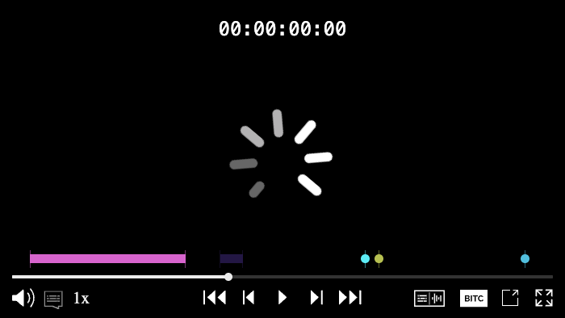

# Omakase Player Chroming

This guide provides documentation on customizing and polishing chroming of the Omakase Player. It covers component structure, styling, and various implementation scenarios, allowing you to tailor the Omakase Player UI to your specific design and functional needs.

---

## What is Player Chroming?

"Chroming" refers to the visual interface layered on top of a media player and includes following capabilities
 * player controls such as play/pause, scrubber, volume and fullscreen
 * overlays such as help, BITC display
 * tracks selector 
 * various specific components as e.g.  marker bar
It's essentially the UI that wraps the core video/audio content, providing interactivity.

---

## Media Chrome Components

Omakase Player uses the [Media Chrome](https://www.media-chrome.org/) library as a base for media chroming. You can use all media chrome components in your custom chroming. Here is a list of media chrome components that are used by Omakase Player for the default chroming:

#### `<media-controller>`

[documentation](https://www.media-chrome.org/docs/en/components/media-controller)

#### `<media-control-bar>`

[documentation](https://www.media-chrome.org/docs/en/components/media-control-bar)

#### `<media-play-button>`

[documentation](https://www.media-chrome.org/docs/en/components/media-play-button)

#### `<media-fullscreen-button>`

[documentation](https://www.media-chrome.org/docs/en/components/media-fullscreen-button)

---

## Omakase Components

In addition to Media Chrome components, Omakase Player also uses custom Omakase components developed for the default chroming:

#### `<omakase-time-display>`

For displaying the current timecode, based on the [media-time-display](https://www.media-chrome.org/docs/en/components/media-time-display) component.

#### `<omakase-time-range>`

For the time range scrubber, based on the [media-time-range](https://www.media-chrome.org/docs/en/components/media-time-range) component.

#### `<omakase-preview-thumbnail>`

For displaying the thumbnail on hovering over the time range, based on the [media-preview-thumbnail](https://www.media-chrome.org/docs/en/components/media-preview-thumbnail) component.

#### `<omakase-volume-range>`

For controlling the output volume, based on the [media-volume-range](https://www.media-chrome.org/docs/en/components/media-volume-range) component.

#### `<omakase-mute-button>`

For muting/unmuting the output volume, based on the [media-mute-button](https://www.media-chrome.org/docs/en/components/media-mute-button) component.

---

### Omakase Dropdown Components

Omakase dropdown components are used to display the playback rate dropdown and main/sidecar audio and text dropdown in the default chroming.

#### `<omakase-dropdown>`

Container for the dropdown list(s). Content can be aligned to `left`, `center` or `right`, using the `align` attribute (default is `left`). Will be closed by clicking outside it, unless the `floating` attribute is set.

#### `<omakase-dropdown-toggle>`

Toggle for the dropdown. Requires the `dropdown` attribute to specify the id of the `<omakase-dropdown>` element.

#### `<omakase-dropdown-list>`

For displaying a list inside the `<omakase-dropdown>` component. Title can be defined using the `title` attribute (if not defined, the title will not be displayed). Width (in pixels) can be defined using the `width` attribute (default is 100px). List type can be set to `default`, `radio` or `checkbox` using the `type` attribute.

#### `<omakase-dropdown-option>`

A single dropdown option. Has `value` and `selected` attributes, similar to an HTML `<option>` tag.

---

### Omakase Marker Components

Omakase marker components are used to display the marker bar containing one or more marker tracks.

#### `<omakase-marker-bar>`

Container for the marker tracks.

#### `<omakase-marker-track>`

A single marker track. Should not be defined explicitly. (Omakase Player will create it inside the `<omakase-marker-bar>` element after calling the `createMarkerTrack` method.)

---

## Default Chroming

Here's the default Omakase Player media chroming (with one marker track):



---

## Custom Chroming Example

You can use a combination of Media Chrome components, Omakase components, custom Web Components or plain HTML for custom chroming. You can also set up multiple Omakase Player instances with different chroming for each one. Here's an example of setting up an Omakase Player with customized chroming:

```html
<div id="omakase-player"></div>
<template id="omakase-media-chrome">
  <media-control-bar>
    <omakase-marker-bar></omakase-marker-bar>
    <omakase-time-range></omakase-time-range>
  </media-control-bar>
</template>
```

```js
let omakasePlayer = new OmakasePlayer({
  playerHTMLElementId: 'omakase-player',
  mediaChromeHTMLElementId: 'omakase-media-chrome',
  mediaChrome: {
    visibility: 'enabled',
  },
});
```

---

## Styling

Media Chrome components and Omakase components based on Media Chrome are easy to style with CSS variables. For the list of CSS variables, refer to the [Media Chrome styling reference](https://www.media-chrome.org/docs/en/reference/styling).

Here's a style customization example:

```css
omakase-time-range {
  height: 4px;
  --media-range-thumb-width: 0;
  --media-range-bar-color: red;
  --media-time-range-hover-height: 10px;
}
```

Here's what the custom chroming example combined with the styling example should look like:


