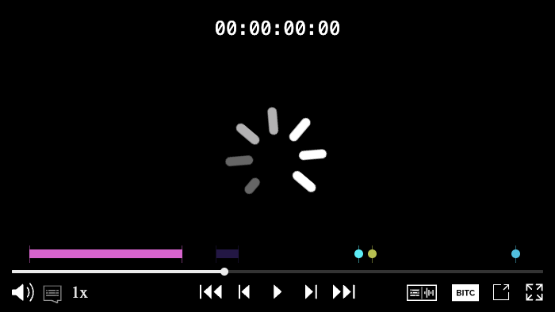
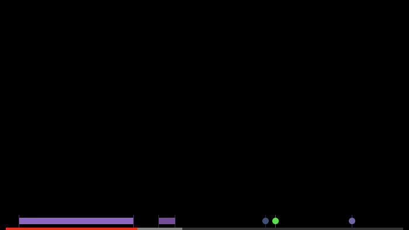
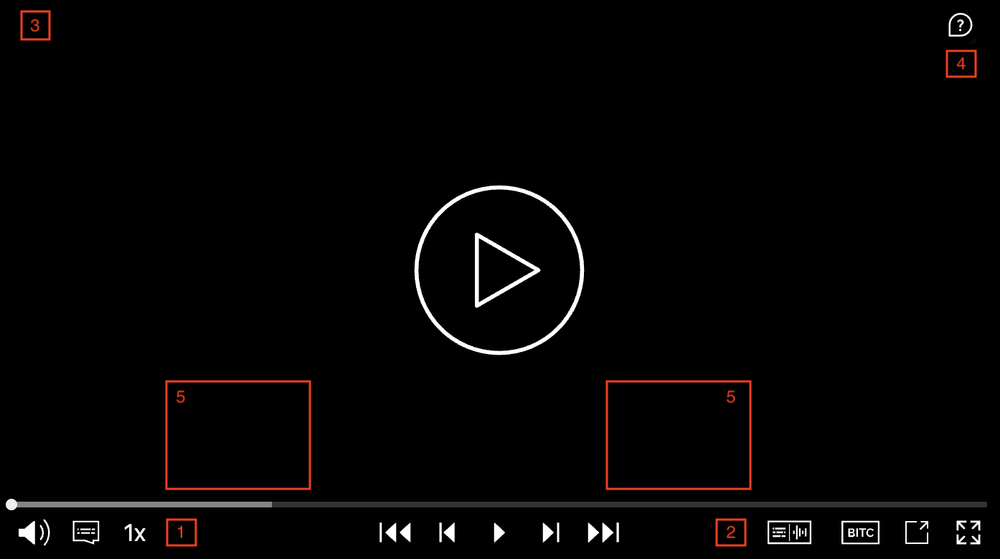
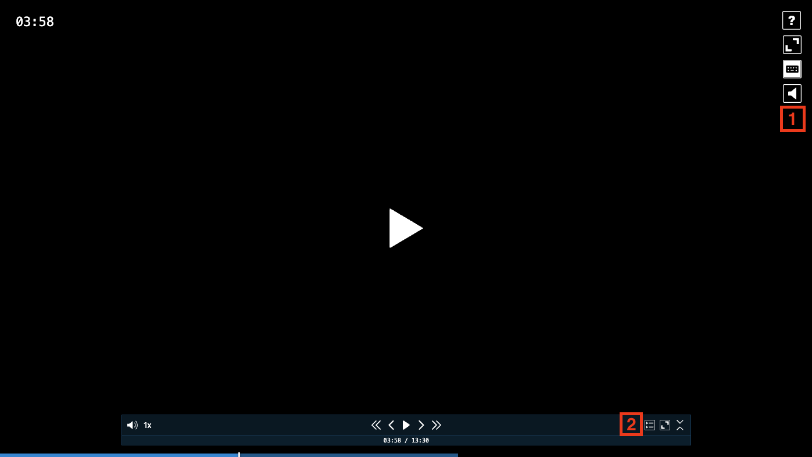

# Omakase Player Chroming

This guide provides documentation on customizing and polishing the UI chroming of the Omakase Player. It covers the architecture, component structure, styling, and various implementation scenarios, allowing you to tailor the Omakase Player UI to your specific design and functional needs.

---

## What is Player Chroming?

"Chroming" refers to the visual interface and controls layered on top of a media player. This includes:

- Player controls such as play/pause, scrubber, volume, and fullscreen
- Overlays such as help menus and timecode displays
- Track selectors for audio and subtitle tracks
- Specialized components such as marker bars and progress bars
- Floating controls and action icons

It's essentially the UI that wraps the core video/audio content, providing interactivity and visual feedback to the user.

---

## Media Chrome Components

Omakase Player builds upon the [Media Chrome](https://www.media-chrome.org/) library as a base for media UI controls. All standard Media Chrome components can be used in custom chroming templates. The default theme uses the following Media Chrome components:

### Core Media Chrome Components

- **`<media-controller>`** - Main container component ([documentation](https://www.media-chrome.org/docs/en/components/media-controller))
- **`<media-control-bar>`** - Control bar container ([documentation](https://www.media-chrome.org/docs/en/components/media-control-bar))
- **`<media-play-button>`** - Play/pause button ([documentation](https://www.media-chrome.org/docs/en/components/media-play-button))
- **`<media-fullscreen-button>`** - Fullscreen toggle button ([documentation](https://www.media-chrome.org/docs/en/components/media-fullscreen-button))

---

## Omakase Components

In addition to Media Chrome components, Omakase Player provides custom components developed to extend the default chroming capabilities. These components are built on top of Media Chrome components and add specialized functionality.

### Core Omakase Components

#### `<omakase-time-display>`

Displays the current timecode, based on the [media-time-display](https://www.media-chrome.org/docs/en/components/media-time-display) component. Can show timecode, countdown timer, or media time based on configuration.

#### `<omakase-time-range>`

Time range scrubber for seeking, based on the [media-time-range](https://www.media-chrome.org/docs/en/components/media-time-range) component.

#### `<omakase-preview-thumbnail>`

Displays a thumbnail preview when hovering over the time range, based on the [media-preview-thumbnail](https://www.media-chrome.org/docs/en/components/media-preview-thumbnail) component.

#### `<omakase-volume-range>`

Controls the output volume with a slider, based on the [media-volume-range](https://www.media-chrome.org/docs/en/components/media-volume-range) component.

#### `<omakase-mute-button>`

Mutes/unmutes the output volume, based on the [media-mute-button](https://www.media-chrome.org/docs/en/components/media-mute-button) component.

#### `<omakase-play-button>`

Play/pause button with frame-stepping capabilities in video mode.

#### `<omakase-fullscreen-button>`

Toggles fullscreen mode for the player.

### Omakase Dropdown Components

Dropdown components are used throughout the themes to display playback rate, audio track, and text track selections.

#### `<omakase-dropdown>`

Container for the dropdown list(s). Content can be aligned to `left`, `center`, or `right` using the `align` attribute (default is `left`). Will close when clicking outside unless the `floating` attribute is set.

#### `<omakase-dropdown-toggle>`

Toggle button for the dropdown. Requires the `dropdown` attribute to reference the id of the target `<omakase-dropdown>` element.

#### `<omakase-dropdown-list>`

Container for displaying options within a `<omakase-dropdown>`. Attributes:

- `title` - Optional title displayed above the list
- `width` - Width in pixels (default is 100px)
- `type` - List type: `default`, `radio`, or `checkbox`

#### `<omakase-dropdown-option>`

Individual dropdown option with `value` and `selected` attributes, similar to HTML `<option>` tags.

### Omakase Marker Components

Marker components display timeline markers and tracks.

#### `<omakase-marker-bars>`

Container for marker bars.

#### `<omakase-marker-bar>`

Individual marker bar element. Displays markers with configurable presentations (colors, editability, etc.). The bar's visibility and marker styling are controlled through `ChromingMarkerBarConfig`.

### Omakase Audio Components

#### `<omakase-audio-visualization>`

Audio visualization component for the Audio theme. Displays waveform visualization for audio playback using the peak processor.

---

## Omakase Player Chroming Configuration

Chroming configuration is passed to the Omakase Player during instantiation:

```javascript
let omakasePlayer = new OmakasePlayer({
  chromingTheme: ChromingTheme.DEFAULT,
  chromingThemeConfig: {
    // theme-specific configuration
  },
  // other chroming options
});
```

Updatable configuration can be changed after instantiation:

```javascript
omakasePlayer.chroming.setThemeConfig({
  // updated theme configuration
});
```

### Common Configuration Properties

| Field                         | Description                                                       | Type                                                               | Required | Updatable | Comments                                                                           |
| ----------------------------- | ----------------------------------------------------------------- | ------------------------------------------------------------------ | -------- | --------- | ---------------------------------------------------------------------------------- |
| `chromingTheme`               | Chroming theme determines how the player will be chromed.         | `ChromingTheme` - See [Available Themes](#available-themes)        | Yes      | No        | Default is `ChromingTheme.DEFAULT`. `ChromingTheme.CHROMELESS` renders without UI. |
| `chromingThemeConfig`         | Theme-specific configuration object                               | See individual theme documentation below                           | No       | Yes       | Structure depends on the selected `theme`                                          |
| `chromingWatermark`           | Watermark text or SVG content                                     | `string`                                                           | No       | Yes       | Can be plain text or SVG XML content                                               |
| `chromingWatermarkVisibility` | Controls watermark visibility during playback                     | `WatermarkVisibility.ALWAYS_ON` \| `WatermarkVisibility.AUTO_HIDE` | No       | No        | Default is `ALWAYS_ON`                                                             |
| `chromingStyleUrl`            | URL(s) for custom CSS styling                                     | `string` \| `string[]`                                             | No       | No        | Can be a single URL or array of URLs                                               |
| `chromingFullscreenChroming`  | Controls whether fullscreen uses custom or browser video controls | `FullscreenChroming.ENABLED` \| `FullscreenChroming.DISABLED`      | No       | No        | Default is `ENABLED` for most themes                                               |

---

## Available Themes

Omakase Player includes six built-in themes:

- **DEFAULT** - Full-featured desktop theme with control bar and floating controls
- **AUDIO** - Specialized theme for audio-only playback with optional visualization
- **STAMP** - Compact theme for micro-presentations (multiple small players)
- **OMAKASE** - Minimalist theme for external control integration
- **CHROMELESS** - No UI chroming, just the media player
- **CUSTOM** - Custom template-based theme

All theme configuration properties marked as updateable will be replicated in detached mode if the detached player theme matches the local player theme.

---

## Default Theme

The DEFAULT theme provides a comprehensive set of controls including a control bar, floating controls, and support for marker tracks.

### Default Theme Configuration

| Field                      | Description                                                 | Type                                                                                                                                                                                                                                                                                     | Updatable | Default                                                                                                                                                                                                      |
| -------------------------- | ----------------------------------------------------------- | ---------------------------------------------------------------------------------------------------------------------------------------------------------------------------------------------------------------------------------------------------------------------------------------- | --------- | ------------------------------------------------------------------------------------------------------------------------------------------------------------------------------------------------------------ |
| `controlBarVisibility`     | Controls visibility of the control bar                      | `ControlBarVisibility.ENABLED` \| `ControlBarVisibility.DISABLED` \| `ControlBarVisibility.FULLSCREEN_ONLY`                                                                                                                                                                              | Yes       | `ENABLED`                                                                                                                                                                                                    |
| `controlBar`               | Array of enabled controls in the control bar                | `DefaultThemeControl[]` - Options: `PLAY`, `FRAME_FORWARD`, `TEN_FRAMES_FORWARD`, `FRAME_BACKWARD`, `TEN_FRAMES_BACKWARD`, `TIME_TOGGLE`, `FULLSCREEN`, `TEXT_TOGGLE`, `VOLUME`, `SCRUBBER`, `TRACK_SELECTOR`, `PLAYBACK_RATE`, `DETACH_TOGGLE`, `ROUTER`, `VU_METER`, `VU_METER_TOGGLE` | Yes       | `PLAY`, `FRAME_FORWARD`, `TEN_FRAMES_FORWARD`, `FRAME_BACKWARD`, `TEN_FRAMES_BACKWARD`, `TIME_TOGGLE`, `DETACH_TOGGLE`, `FULLSCREEN`, `TEXT_TOGGLE`, `VOLUME`, `SCRUBBER`, `TRACK_SELECTOR`, `PLAYBACK_RATE` |
| `floatingControls`         | Floating controls shown during playback                     | `DefaultThemeFloatingControl[]` - Options: `ACTION_ICONS`, `PLAYBACK_CONTROLS`, `TIME`, `VU_METER`                                                                                                                                                                                       | No        | `ACTION_ICONS`, `PLAYBACK_CONTROLS`                                                                                                                                                                          |
| `alwaysOnFloatingControls` | Floating controls always visible (even when idle)           | `DefaultThemeFloatingControl[]` - Options: `ACTION_ICONS`, `PLAYBACK_CONTROLS`, `TIME`, `VU_METER`                                                                                                                                                                                       | No        | `VU_METER`                                                                                                                                                                                                   |
| `actionIcons`              | Action icons to display                                     | `DefaultThemeActionIcon[]` - Options: `HELP_MENU`, `TRACK_SELECTOR`, `ROUTER`                                                                                                                                                                                                            | No        | `HELP_MENU`                                                                                                                                                                                                  |
| `playbackRates`            | Array of available playback rates in the dropdown menu      | `number[]`                                                                                                                                                                                                                                                                               | No        | `[0.25, 0.5, 0.75, 1, 2, 4, 8]`                                                                                                                                                                              |
| `trackSelectorAutoClose`   | Whether track selection menu closes after selection         | `boolean`                                                                                                                                                                                                                                                                                | No        | `true`                                                                                                                                                                                                       |
| `timeFormat`               | Format for time display                                     | `ChromingTimeFormat.TIMECODE` \| `ChromingTimeFormat.COUNTDOWN_MEDIA_TIME` \| `ChromingTimeFormat.MEDIA_TIME`                                                                                                                                                                            | Yes       | `TIMECODE`                                                                                                                                                                                                   |
| `vuMeterConfig`            | Shared configuration for floating and control bar VU meters | `Partial<ChromingVuMeterConfig>`                                                                                                                                                                                                                                                         | Yes       | See [VU Meter Configuration](#vu-meter-configuration)                                                                                                                                                        |
| `floatingVuMeterConfig`    | Override values for the floating VU meter configuration     | `Partial<ChromingVuMeterConfig>`                                                                                                                                                                                                                                                         | Yes       | -                                                                                                                                                                                                            |
| `controlBarVuMeterConfig`  | Override values for the control bar VU meter configuration  | `Partial<ChromingVuMeterConfig>`                                                                                                                                                                                                                                                         | Yes       | -                                                                                                                                                                                                            |
| `htmlTemplateId`           | ID of custom HTML template for override/slots               | `string`                                                                                                                                                                                                                                                                                 | No        | -                                                                                                                                                                                                            |

### Default Theme Example

This is the default Omakase Player media chroming (with one marker track):



Visibility and behaviour of some elements of the default chroming theme can be modified with configuration. Some code samples are shown below:

```js
let omakasePlayer = new OmakasePlayer({
  chromingTheme: ChromingTheme.DEFAULT,
  chromingWatermark: 'DEMO_SAMPLE',
  chromingThemeConfig: {
    controlBarVisibility: ControlBarVisibility.ENABLED,
    controlBar: [DefaultThemeControl.PLAY, DefaultThemeControl.SCRUBBER, DefaultThemeControl.VOLUME, DefaultThemeControl.TRACK_SELECTOR, DefaultThemeControl.FULLSCREEN],
    trackSelectorAutoClose: false,
  },
});
```

```js
let omakasePlayer = new OmakasePlayer({
  chromingTheme: ChromingTheme.DEFAULT,
  chromingThemeConfig: {
    controlBarVisibility: ControlBarVisibility.DISABLED,
    floatingControls: [DefaultThemeFloatingControl.PLAYBACK_CONTROLS],
  },
});
```

---

## Audio Theme

The AUDIO theme is specialized for audio-only playback with optional audio visualization and frequency display.

### Audio Theme Configuration

| Field                      | Description                                      | Type                                                                                                               | Updatable | Default                                                                 |
| -------------------------- | ------------------------------------------------ | ------------------------------------------------------------------------------------------------------------------ | --------- | ----------------------------------------------------------------------- |
| `controlBarVisibility`     | Specifies controls visibility                    | `ControlBarVisibility.ENABLED` \| `ControlBarVisibility.DISABLED`                                                  | Yes       | `ENABLED`                                                               |
| `controlBar`               | Array of enabled controls in control bar         | `AudioThemeControl[]` - Options: `PLAY`, `VOLUME`, `PLAYBACK_RATE`, `TRACK_SELECTOR`, `SCRUBBER`, `TIME`, `ROUTER` | Yes       | `PLAY`, `VOLUME`, `PLAYBACK_RATE`, `TRACK_SELECTOR`, `SCRUBBER`, `TIME` |
| `floatingControls`         | Floating controls shown during playback          | `AudioThemeFloatingControl[]` - Options: `PLAYBACK_CONTROLS`, `HELP_MENU`                                          | No        | All controls                                                            |
| `alwaysOnFloatingControls` | Floating controls always visible during playback | `AudioThemeFloatingControl[]` - Options: `PLAYBACK_CONTROLS`, `HELP_MENU`                                          | No        | []                                                                      |
| `playbackRates`            | Available playback rates in menu                 | `number[]`                                                                                                         | No        | `[0.5, 0.75, 1, 2]`                                                     |
| `playerSize`               | Audio player size                                | `AudioPlayerSize.FULL` \| `AudioPlayerSize.COMPACT`                                                                | Yes       | `FULL`                                                                  |
| `visualization`            | Enable/disable audio visualization               | `AudioVisualization.ENABLED` \| `AudioVisualization.DISABLED`                                                      | No        | `DISABLED`                                                              |
| `visualizationConfig`      | Configuration for audio visualization            | `AudioVisualizationConfig`                                                                                         | No        | See below                                                               |
| `timeFormat`               | Format for time display                          | `ChromingTimeFormat.TIMECODE` \| `ChromingTimeFormat.COUNTDOWN_MEDIA_TIME` \| `ChromingTimeFormat.MEDIA_TIME`      | Yes       | `TIMECODE`                                                              |
| `htmlTemplateId`           | ID of custom HTML template for override/slots    | `string`                                                                                                           | No        | -                                                                       |

### Audio Visualization Configuration

When `visualization` is set to `ENABLED`, the `visualizationConfig` object supports:

| Field         | Description                            | Type       | Default                                        |
| ------------- | -------------------------------------- | ---------- | ---------------------------------------------- |
| `strokeColor` | Border color of the visualization bars | `string`   | `#9968BF`                                      |
| `fillColors`  | Gradient colors for visualization bars | `string[]` | `['#F79433', '#88B840', '#CC6984', '#662D91']` |

### Audio Theme Example

```javascript
let omakasePlayer = new OmakasePlayer({
  chromingTheme: ChromingTheme.AUDIO,
  chromingThemeConfig: {
    visualization: AudioVisualization.ENABLED,
    visualizationConfig: {
      strokeColor: '#FFFFFF',
      fillColors: ['#FF0000', '#00FF00', '#0000FF'],
    },
  },
});
```

---

## Stamp Theme

The STAMP theme is a compact, floating-control focused theme designed for micro-presentations where multiple small video players are displayed on the same page.

### Stamp Theme Configuration

| Field                      | Description                                   | Type                                                                                                          | Updatable | Default                                |
| -------------------------- | --------------------------------------------- | ------------------------------------------------------------------------------------------------------------- | --------- | -------------------------------------- |
| `floatingControls`         | Floating controls shown during playback       | `StampThemeFloatingControl[]` - Options: `PROGRESS_BAR`, `TIME`, `PLAYBACK_CONTROLS`, `ACTION_ICONS`          | No        | All controls                           |
| `alwaysOnFloatingControls` | Floating controls always visible              | `StampThemeFloatingControl[]` - Options: `PROGRESS_BAR`, `TIME`, `PLAYBACK_CONTROLS`, `ACTION_ICONS`          | No        | `PROGRESS_BAR`, `TIME`, `ACTION_ICONS` |
| `actionIcons`              | Action icons to display                       | `StampThemeActionIcon[]` - Options: `FULLSCREEN`, `AUDIO_TOGGLE`                                              | No        | `AUDIO_TOGGLE`                         |
| `stampScale`               | How video fills the container                 | `StampThemeScale.FILL` \| `StampThemeScale.FIT`                                                               | Yes       | `FIT`                                  |
| `timeFormat`               | Format for time display                       | `ChromingTimeFormat.TIMECODE` \| `ChromingTimeFormat.COUNTDOWN_MEDIA_TIME` \| `ChromingTimeFormat.MEDIA_TIME` | Yes       | `MEDIA_TIME`                           |
| `htmlTemplateId`           | ID of custom HTML template for override/slots | `string`                                                                                                      | No        | -                                      |

### Stamp Theme Example

```javascript
let omakasePlayer = new OmakasePlayer({
  chromingTheme: ChromingTheme.STAMP,
  chromingThemeConfig: {
    alwaysOnFloatingControls: [StampThemeFloatingControl.PLAYBACK_CONTROLS],
    stampScale: StampThemeScale.FIT,
    timeFormat: ChromingTimeFormat.TIMECODE,
  },
});
```

---

## Omakase Theme

The OMAKASE theme is a minimalist theme designed for scenarios where complex controls are implemented outside the player (e.g., in an external toolbar or control panel).

### Omakase Theme Configuration

| Field                      | Description                                                 | Type                                                                                                                                                                                                                                                                   | Updatable | Default                                                                                                                                                                                    |
| -------------------------- | ----------------------------------------------------------- | ---------------------------------------------------------------------------------------------------------------------------------------------------------------------------------------------------------------------------------------------------------------------- | --------- | ------------------------------------------------------------------------------------------------------------------------------------------------------------------------------------------ |
| `controlBarVisibility`     | Control bar visibility                                      | `OmakaseControlBarVisibility.ENABLED` \| `OmakaseControlBarVisibility.DISABLED` \| `OmakaseControlBarVisibility.ALWAYS_ON`                                                                                                                                             | Yes       | `ENABLED`                                                                                                                                                                                  |
| `controlBar`               | Enabled controls in control bar                             | `OmakaseThemeControl[]` - Options: `PLAY`, `FRAME_FORWARD`, `TEN_FRAMES_FORWARD`, `FRAME_BACKWARD`, `TEN_FRAMES_BACKWARD`, `FULLSCREEN`, `VOLUME`, `TRACK_SELECTOR`, `PLAYBACK_RATE`, `DETACH_TOGGLE`, `CLOSE`, `TIME_TOGGLE`, `ROUTER`, `VU_METER`, `VU_METER_TOGGLE` | Yes       | `PLAY`, `FRAME_BACKWARD`, `TEN_FRAMES_BACKWARD`, `FRAME_FORWARD`, `TEN_FRAMES_FORWARD`, `VOLUME`, `PLAYBACK_RATE`, `TRACK_SELECTOR`, `FULLSCREEN`, `DETACH_TOGGLE`, `CLOSE`, `TIME_TOGGLE` |
| `floatingControls`         | Floating controls shown during playback                     | `OmakaseThemeFloatingControl[]` - Options: `PROGRESS_BAR`, `TIME`, `PLAYBACK_CONTROLS`, `ACTION_ICONS`, `VU_METER`                                                                                                                                                     | No        | `PLAYBACK_CONTROLS`, `PROGRESS_BAR`, `TIME`, `ACTION_ICONS`                                                                                                                                |
| `alwaysOnFloatingControls` | Floating controls always visible                            | `OmakaseThemeFloatingControl[]` - Options: `PROGRESS_BAR`, `TIME`, `PLAYBACK_CONTROLS`, `ACTION_ICONS`, `VU_METER`                                                                                                                                                     | No        | `TIME`, `PROGRESS_BAR`, `VU_METER`                                                                                                                                                         |
| `actionIcons`              | Action icons to display                                     | `OmakaseThemeActionIcon[]` - Options: `HELP_MENU`, `FULLSCREEN`, `AUDIO_TOGGLE`, `VOLUME`, `CONTROL_BAR_TOGGLE`                                                                                                                                                        | No        | `HELP_MENU`, `AUDIO_TOGGLE`, `FULLSCREEN`                                                                                                                                                  |
| `timeFormat`               | Format for time display                                     | `ChromingTimeFormat.TIMECODE` \| `ChromingTimeFormat.MEDIA_TIME`                                                                                                                                                                                                       | Yes       | `TIMECODE`                                                                                                                                                                                 |
| `progressBarPosition`      | Position of the control bar relative to the video           | `OmakaseProgressBarPosition.OVER_VIDEO` \| `OmakaseProgressBarPosition.UNDER_VIDEO`                                                                                                                                                                                    | Yes       | `OVER_VIDEO`                                                                                                                                                                               |
| `playbackRates`            | Available playback rates in menu                            | `number[]`                                                                                                                                                                                                                                                             | No        | `[0.25, 0.5, 0.75, 1, 2, 4, 8]`                                                                                                                                                            |
| `vuMeterConfig`            | Shared configuration for floating and control bar VU meters | `Partial<ChromingVuMeterConfig>`                                                                                                                                                                                                                                       | Yes       | See [VU Meter Configuration](#vu-meter-configuration)                                                                                                                                      |
| `floatingVuMeterConfig`    | Override values for the floating VU meter configuration     | `Partial<ChromingVuMeterConfig>`                                                                                                                                                                                                                                       | Yes       | -                                                                                                                                                                                          |
| `controlBarVuMeterConfig`  | Override values for the control bar VU meter configuration  | `Partial<ChromingVuMeterConfig>`                                                                                                                                                                                                                                       | Yes       | -                                                                                                                                                                                          |
| `htmlTemplateId`           | ID of custom HTML template for override/slots               | `string`                                                                                                                                                                                                                                                               | No        | -                                                                                                                                                                                          |

### Omakase Theme Example

```javascript
let omakasePlayer = new OmakasePlayer({
  chromingTheme: ChromingTheme.OMAKASE,
  chromingThemeConfig: {
    actionIcons: [OmakaseThemeActionIcon.AUDIO_TOGGLE, OmakaseThemeActionIcon.VOLUME, OmakaseThemeActionIcon.CONTROL_BAR_TOGGLE],
    timeFormat: ChromingTimeFormat.TIMECODE,
    progressBarPosition: OmakaseProgressBarPosition.UNDER_VIDEO,
  },
});
```

---

## Chromeless Theme

The CHROMELESS theme disables all default chroming, rendering the player without any UI controls.

### Chromeless Theme Configuration

| Field                      | Description                                          | Type                                                                                                          | Updatable | Default     |
| -------------------------- | ---------------------------------------------------- | ------------------------------------------------------------------------------------------------------------- | --------- | ----------- |
| `timeFormat`               | Format for time display (if time control is enabled) | `ChromingTimeFormat.TIMECODE` \| `ChromingTimeFormat.COUNTDOWN_MEDIA_TIME` \| `ChromingTimeFormat.MEDIA_TIME` | Yes       | `TIMECODE`  |
| `floatingControls`         | Floating controls shown during playback              | `ChromelessThemeFloatingControl[]` - Only option: `TIME`                                                      | No        | No controls |
| `alwaysOnFloatingControls` | Floating controls always visible                     | `ChromelessThemeFloatingControl[]` - Only option: `TIME`                                                      | No        | `TIME`      |

### Chromeless Theme Example

```javascript
let omakasePlayer = new OmakasePlayer({
  chromingTheme: ChromingTheme.CHROMELESS,
  chromingThemeConfig: {
    floatingControls: [ChromelessThemeFloatingControl.TIME],
  },
});
```

---

## Custom Theme

The CUSTOM theme allows you to define your own HTML template using Media Chrome components, Omakase components, custom Web Components, or plain HTML. This provides complete control over the player UI layout and styling.

### Custom Theme Configuration

| Field            | Description                       | Type     | Updatable | Required |
| ---------------- | --------------------------------- | -------- | --------- | -------- |
| `htmlTemplateId` | ID of the custom template element | `string` | No        | Yes      |

### Custom Theme Example

```html
<div id="omakase-player"></div>
<template id="custom-template">
  <media-control-bar>
    <omakase-play-button></omakase-play-button>
    <omakase-time-range></omakase-time-range>
    <omakase-volume-range></omakase-volume-range>
    <omakase-fullscreen-button></omakase-fullscreen-button>
  </media-control-bar>
</template>
```

```javascript
let omakasePlayer = new OmakasePlayer({
  playerHTMLElementId: 'omakase-player',
  chromingTheme: ChromingTheme.CUSTOM,
  chromingThemeConfig: {
    htmlTemplateId: 'custom-template',
  },
});
```

---

## VU Meter Configuration

The VU meter is available in the DEFAULT and OMAKASE themes. Both themes share a common `vuMeterConfig` as a base, with optional per-position overrides via `floatingVuMeterConfig` and `controlBarVuMeterConfig`. When an override is set, it is merged on top of `vuMeterConfig` for that position only.

### ChromingVuMeterConfig

| Field               | Description                                                      | Type                                                                   | Default                                           |
| ------------------- | ---------------------------------------------------------------- | ---------------------------------------------------------------------- | ------------------------------------------------- |
| `theme`             | Visual theme of the VU meter                                     | `VuMeterTheme.DEFAULT` \| `VuMeterTheme.LED`                           | `DEFAULT`                                         |
| `scale`             | dB scale preset                                                  | `VuMeterScale.DEFAULT` \| `VuMeterScale.NORDIC` \| `VuMeterScale.NONE` | `DEFAULT`                                         |
| `rangeMinDb`        | Minimum dB value shown on the meter (bottom of the scale)        | `number`                                                               | `-54`                                             |
| `scaleStepDb`       | Interval between scale tick marks in dB                          | `number`                                                               | `6`                                               |
| `scaleOffsetDb`     | Offset applied to scale label values in dB                       | `number`                                                               | `0`                                               |
| `levelHoldDuration` | Duration in milliseconds the peak hold indicator remains visible | `number`                                                               | `0`                                               |
| `channels`          | Number of audio channels to display                              | `number`                                                               | `2`                                               |
| `labels`            | Channel labels displayed beneath each bar                        | `string[]`                                                             | `['L', 'R', 'C', 'LFE', 'Ls', 'Rs']`              |
| `style`             | VU meter styling customization                                   | `Partial<ChromingVuMeterStyle>`                                        | See [ChromingVuMeterStyle](#chromingvumeterstyle) |

### ChromingVuMeterStyle

| Field             | Description                                                                      | Type             | Default       |
| ----------------- | -------------------------------------------------------------------------------- | ---------------- | ------------- |
| `levelColors`     | Array of color thresholds for the level bar - See [VuMeterColor](#vumetertcolor) | `VuMeterColor[]` | See below     |
| `levelBackground` | Background color of the level bar or LED segments                                | `string`         | `transparent` |

Default `levelColors`:

| `maxValueDb` | `color`   | `holdColor` |
| ------------ | --------- | ----------- |
| `-20`        | `#04E400` | `#04E40088` |
| `-10`        | `#F27100` | `#F2710088` |
| `0`          | `#BB0000` | `#BB000088` |

### VuMeterColor

Each entry in `levelColors` defines a color segment. Usage of colors in the visualization is dependent on the theme.

| Field        | Description                            | Type     |
| ------------ | -------------------------------------- | -------- |
| `maxValueDb` | Upper bound of the color segment in dB | `number` |
| `color`      | Level segment color                    | `string` |
| `holdColor`  | Hold level segment color               | `string` |

### VU Meter Configuration Example

```javascript
omakasePlayer.chroming
  .setVuMeterConfig({
    channels: 2,
    rangeMinDb: -60,
    levelHoldDuration: 2000,
    style: {
      levelColors: [
        {maxValueDb: -18, color: '#00CC00', holdColor: '#00CC0088'},
        {maxValueDb: -6, color: '#CCCC00', holdColor: '#CCCC0088'},
        {maxValueDb: 0, color: '#CC0000', holdColor: '#CC000088'},
      ],
    },
  })
  .subscribe(() => {
    console.log('VU meter config updated');
  });
```

---

## Chroming Api Methods

The `ChromingApi` interface provides methods for runtime control and configuration of the player's chroming. These methods are available on the `omakasePlayer.chroming` object.

#### `state: ChromingState`

Property providing access to current chroming state including theme, theme configuration, watermark, marker tracks, and safe zones.

### Element Access

#### `getPlayerChromingElement<T>(querySelector: string): T`

Retrieves a DOM element from the chroming template using a CSS selector.

```javascript
const timeDisplay = omakasePlayer.chroming.getPlayerChromingElement('.time-container');
const dropdown = omakasePlayer.chroming.getPlayerChromingElement('#quality-dropdown');
```

### Safe Zones

Safe zones define areas within the video where content should not be displayed (e.g., safe area for title overlays on broadcast video).

#### `addSafeZone(videoSafeZone: Partial<VideoSafeZone>): Observable<VideoSafeZone>`

Adds a new safe zone to the player.

```javascript
omakasePlayer.chroming
  .addSafeZone({
    topRightBottomLeftPercent: [5, 5, 5, 5], // top, right, bottom, left percentages
    htmlId: 'my-safe-zone',
    htmlClass: 'safe-zone-overlay',
  })
  .subscribe((zone) => {
    console.log('Safe zone added:', zone.id);
  });
```

#### `videoSafeZones: VideoSafeZone[]`

Property containing all currently registered safe zones.

#### `removeSafeZone(id: string): Observable<void>`

Removes a specific safe zone by ID.

```javascript
omakasePlayer.chroming.removeSafeZone('my-safe-zone').subscribe(() => {
  console.log('Safe zone removed');
});
```

#### `removeAllSafeZones(): Observable<void>`

Removes all registered safe zones.

```javascript
omakasePlayer.chroming.removeAllSafeZones().subscribe(() => {
  console.log('All safe zones removed');
});
```

### Help Menu

#### `helpMenuGroups: HelpMenuGroup[]`

Property containing all help menu groups. Each group contains a name and array of help menu items.

#### `addHelpMenuGroup(helpMenuGroup: HelpMenuGroup, insertPosition: HelpMenuGroupInsertPosition): Observable<HelpMenuGroup>`

Adds a new group of help menu items.

```javascript
omakasePlayer.chroming
  .addHelpMenuGroup(
    {
      name: 'Custom Help',
      items: [
        {
          name: 'Custom Feature',
          description: 'This is a custom feature',
        },
      ],
    },
    HelpMenuGroupInsertPosition.Append
  )
  .subscribe((group) => {
    console.log('Help menu group added:', group.name);
  });
```

#### `clearHelpMenuGroups(): Observable<void>`

Removes all help menu groups.

```javascript
omakasePlayer.chroming.clearHelpMenuGroups().subscribe(() => {
  console.log('Help menus cleared');
});
```

### Time Display Control

#### `isFloatingTimeVisible: boolean | undefined`

Property indicating whether the floating time display is currently visible.

#### `timeFormat: ChromingTimeFormat | undefined`

Property indicating the current time format (`TIMECODE`, `COUNTDOWN_MEDIA_TIME`, or `MEDIA_TIME`).

#### `setFloatingTimeVisible(visible: boolean): Observable<void>`

Shows or hides the floating time display.

```javascript
omakasePlayer.chroming.setFloatingTimeVisible(true).subscribe(() => {
  console.log('Floating time is now visible');
});
```

#### `setTimeFormat(timeFormat: ChromingTimeFormat): Observable<void>`

Changes the time display format.

```javascript
import {ChromingTimeFormat} from 'omakase-player';

omakasePlayer.chroming.setTimeFormat(ChromingTimeFormat.TIMECODE).subscribe(() => {
  console.log('Time format changed to timecode');
});

omakasePlayer.chroming.setTimeFormat(ChromingTimeFormat.COUNTDOWN_MEDIA_TIME).subscribe(() => {
  console.log('Time format changed to countdown timer');
});

omakasePlayer.chroming.setTimeFormat(ChromingTimeFormat.MEDIA_TIME).subscribe(() => {
  console.log('Time format changed to media time');
});
```

### VU Meter

#### `getVuMeterConfig(position?: ChromingVuMeterPosition): ChromingVuMeterConfig`

Returns the resolved VU meter configuration for a given position. If `position` is omitted, returns the shared base `vuMeterConfig`. Position-specific overrides are merged in when a position is specified.

```javascript
// Get the shared base config
const config = omakasePlayer.chroming.getVuMeterConfig();

// Get the resolved config for the floating VU meter
const floatingConfig = omakasePlayer.chroming.getVuMeterConfig(ChromingVuMeterPosition.FLOATING);

// Get the resolved config for the control bar VU meter
const controlBarConfig = omakasePlayer.chroming.getVuMeterConfig(ChromingVuMeterPosition.CONTROL_BAR);
```

#### `setVuMeterConfig(config: Partial<ChromingVuMeterConfig>, position?: ChromingVuMeterPosition): Observable<void>`

Updates the VU meter configuration. If `position` is omitted, updates the shared base `vuMeterConfig` which affects all VU meter positions. Pass a position to update only the override for that position.

```javascript
// Update shared config for all VU meters
omakasePlayer.chroming.setVuMeterConfig({channels: 6, levelHoldDuration: 1500}).subscribe(() => {
  console.log('VU meter config updated');
});

// Update only the floating VU meter override
omakasePlayer.chroming.setVuMeterConfig({channels: 2}, ChromingVuMeterPosition.FLOATING).subscribe(() => {
  console.log('Floating VU meter config updated');
});
```

#### `setFloatingVuMeterVisible(visible: boolean): Observable<void>`

Shows or hides the floating VU meter.

```javascript
omakasePlayer.chroming.setFloatingVuMeterVisible(false).subscribe(() => {
  console.log('Floating VU meter hidden');
});
```

### Theme Configuration

#### `setThemeConfig(themeConfig: Partial<ChromingThemeConfigTypes>): Observable<void>`

Updates theme-specific configuration at runtime. Changes are applied immediately.

```javascript
// For DEFAULT theme
omakasePlayer.chroming
  .setThemeConfig({
    controlBarVisibility: ControlBarVisibility.DISABLED,
    floatingControls: [DefaultThemeFloatingControl.PLAYBACK_CONTROLS],
  })
  .subscribe(() => {
    console.log('Theme configuration updated');
  });

// For STAMP theme
omakasePlayer.chroming
  .setThemeConfig({
    stampScale: StampThemeScale.FILL,
    timeFormat: ChromingTimeFormat.MEDIA_TIME,
  })
  .subscribe(() => {
    console.log('STAMP theme updated');
  });
```

#### `setWatermark(watermark: string | undefined): Observable<void>`

Sets or removes the watermark. Can be plain text or SVG XML content.

```javascript
omakasePlayer.chroming.setWatermark('© 2024 My Company').subscribe(() => {
  console.log('Watermark set');
});

omakasePlayer.chroming.setWatermark(undefined).subscribe(() => {
  console.log('Watermark removed');
});
```

### Marker Bars

#### `addMarkerBar(url: string, destination: ChromingTrackDestination, options?: TrackLoadOptions, config?: Partial<ChromingMarkerTrackConfig>): Observable<ChromingMarkerBarHandlerApi>`

#### `addMarkerBar(source: Source, destination: ChromingTrackDestination, options?: TrackLoadOptions, config?: Partial<ChromingMarkerTrackConfig>): Observable<ChromingMarkerBarHandlerApi>`

Adds a new marker bar from a URL or Source object to either the marker bar area or progress bar.

```javascript
import {ChromingTrackDestination, TrackSource} from 'omakase-player';

// Create from URL
omakasePlayer.chroming
  .addMarkerBar('https://example.com/markers.vtt', ChromingTrackDestination.MARKER_BARS, undefined, {
    id: 'marker-track-1',
    visible: true,
  })
  .subscribe((markerBarApi) => {
    console.log('Marker bar added:', markerBarApi);
  });

// Create from existing track
this._omakasePlayer.track
  .load('https://example.com/markers.vtt', {
    trackType: TrackType.MARKER_TRACK,
  })
  .subscribe((track) => {
    omakasePlayer.chroming
      .addMarkerBar(TrackSource.of(track.id), ChromingTrackDestination.MARKER_BARS, undefined, {
        id: 'marker-track-2',
        visible: true,
      })
      .subscribe((markerBarApi) => {
        console.log('Marker bar added:', markerBarApi);
      });
  });

// Create on progress bar
omakasePlayer.chroming.addMarkerBar('https://example.com/progress-markers.vtt', ChromingTrackDestination.PROGRESS_BAR).subscribe((markerBarApi) => {
  console.log('Progress bar marker bar added');
});
```

#### `getMarkerBars(): ChromingMarkerBarHandlers`

Retrieves all marker bars, grouped by their position in chroming (progress bar or marker bars area)

```javascript
// Get marker track by ID
const {PROGRESS_BAR, MARKER_BARS} = omakasePlayer.chroming.getMarkerBars();
if (PROGRESS_BAR) {
  // Interact with progress bar marker bar
}
if (MARKER_BARS) {
  // Interact with marker bars area marker bars
}
```

#### `getMarkerBar(id: string): ChromingMarkerBarHandlerApi | undefined`

Retrieves a marker bar by ID. Returns `undefined` if not found.

```javascript
// Get marker track by ID
const markerBar = omakasePlayer.chroming.getMarkerBar('main-markers');
if (markerBar) {
  // Interact with marker bar
}
```

#### `deleteMarkerBar(id: string): Observable<void>`

Removes a marker bar by ID.

```javascript
omakasePlayer.chroming.deleteMarkerBar('main-markers').subscribe(() => {
  console.log('Marker bar removed');
});
```

### Thumbnail Track

#### `setThumbnailTrack(url: string, options?: TrackLoadOptions): Observable<void>`

#### `setThumbnailTrack(source: Source, options?: TrackLoadOptions): Observable<void>`

#### `setThumbnailTrack(empty: undefined): Observable<void>`

Sets or clears the thumbnail track used for preview in the time range scrubber.

```javascript
import {TrackSource} from 'omakase-player';

// Load from URL
omakasePlayer.chroming.setThumbnailTrack('https://example.com/thumbs.vtt').subscribe(() => {
  console.log('Thumbnail track loaded');
});

// Load from existing track
this._omakasePlayer.track
  .load('https://example.com/thumbs.vtt', {
    trackType: TrackType.MARKER_TRACK,
  })
  .subscribe((track) => {
    omakasePlayer.chroming.setThumbnailTrack(TrackSource.of(track.id)).subscribe(() => {
      console.log('Thumbnail track loaded');
    });
  });

// Clear thumbnail track
omakasePlayer.chroming.setThumbnailTrack(undefined).subscribe(() => {
  console.log('Thumbnail track cleared');
});
```

### Events

#### `onEvent$: Observable<ChromingEvent>`

Observable stream emitting chroming events such as theme changes, configuration updates, and state changes.

```javascript
omakasePlayer.chroming.onEvent$.subscribe((event) => {
  console.log('Chroming event:', event.type, event.data);
});
```

### Fullscreen

#### `toggleFullScreen(): Observable<void>`

Toggles fullscreen mode for the player.

```javascript
omakasePlayer.chroming.toggleFullScreen().subscribe(() => {
  console.log('Fullscreen toggled');
});
```

---

## Styling

Player chroming style can be customised by passing a css file url. The parameter `styleUrl` can be an array to provide multiple css files.

```js
let omakasePlayer = new OmakasePlayer({
  playerHTMLElementId: 'omakase-player',
  chromingStyleUrl: './style.css',
});
```

The CSS structure of the `DEFAULT` theme is shown below:


The CSS structure of the `AUDIO` theme is shown below:


The CSS structure of the `STAMP` theme is shown below:


The CSS structure of the `OMAKASE` theme is shown below:


Media Chrome components and Omakase components based on Media Chrome are easy to style with CSS variables. For the list of CSS variables, refer to the [Media Chrome styling reference](https://www.media-chrome.org/docs/en/reference/styling).

Here's a style customization example:

```css
omakase-time-range {
  height: 4px;
  --media-range-thumb-width: 0;
  --media-range-bar-color: red;
  --media-time-range-hover-height: 10px;
}
```

Here's what the custom chroming example combined with the styling example should look like:



---

## Custom slots

You can insert your own custom HTML into specified areas of certain themes. The available slots for the `DEFAULT` and `AUDIO` themes are:

| Slot                 | Position                                                                           |
| -------------------- | ---------------------------------------------------------------------------------- |
| `start-container`    | Left side of the control bar, after the playback speed dropdown toggle (1)         |
| `end-container`      | Right side of the control bar, before the audio/text selection dropdown toggle (2) |
| `top-left`           | Top left corner of the player, over the watermark area (3)                         |
| `top-right`          | Top right corner of the player, under the help button (4)                          |
| `dropdown-container` | Above the control (5)                                                              |



The available slots for the `STAMP` theme are:

| Slot        | Position                                                              |
| ----------- | --------------------------------------------------------------------- |
| `top-right` | Top right corner of the player, under the help/mute/unmute button (1) |


The available slots for the `OMAKASE` theme are:

| Slot            | Position                                                                           |
| --------------- | ---------------------------------------------------------------------------------- |
| `top-right`     | Top right corner of the player, under the help/mute/unmute button (1)              |
| `end-container` | Right side of the control bar, before the audio/text selection dropdown toggle (2) |



Here is an example of adding a custom dropdown to the `DEFAULT` theme using custom slots:

```javascript
let omakasePlayer = new OmakasePlayer({
  playerHTMLElementId: 'omakase-player',
  chromingTheme: 'DEFAULT',
  chromingThemeConfig: {
    htmlTemplateId: 'omakase-chroming-slots',
  },
});
```

```html
<template id="omakase-chroming-slots">
  <omakase-dropdown slot="dropdown-container" id="quality">
    <omakase-dropdown-list class="quality-dropdown-list" title="Quality" width="100">
      <omakase-dropdown-option value="auto" selected>Auto</omakase-dropdown-option>
      <omakase-dropdown-option value="360">360p</omakase-dropdown-option>
      <omakase-dropdown-option value="720">720p</omakase-dropdown-option>
      <omakase-dropdown-option value="1080">1080p</omakase-dropdown-option>
    </omakase-dropdown-list>
  </omakase-dropdown>
  <omakase-dropdown-toggle slot="start-container" dropdown="quality"></omakase-dropdown-toggle>
</template>
```

```javascript
omakasePlayer.chroming.getPlayerChromingElement('.quality-dropdown-list').selectedOption$.subscribe((option) => {
  if (option) {
    omakasePlayer.loadVideo(`https://my-server.com/myvideo-${option.value}.m3u8`);
  }
});
```

## Conditional templates

Player chroming can have conditional sub-templates that are either hidden or only shown in full screen. Code example is shown below:

```html
<template id="default">
  <media-controller>
    <slot name="media" slot="media"></slot>
    <template if="!fullscreen">
      <media-control-bar>
        <media-play-button></media-play-button>
        <media-time-display show-duration></media-time-display>
        <media-time-range></media-time-range>
        <media-playback-rate-button></media-playback-rate-button>
        <media-mute-button></media-mute-button>
        <media-volume-range></media-volume-range>
      </media-control-bar>
    </template>
    <template if="fullscreen">
      <media-control-bar>
        <media-play-button></media-play-button>
      </media-control-bar>
    </template>
  </media-controller>
</template>
```

For more information on conditional templates, refer to the [Media Chrome conditionals reference](https://www.media-chrome.org/docs/en/themes#conditionals)
